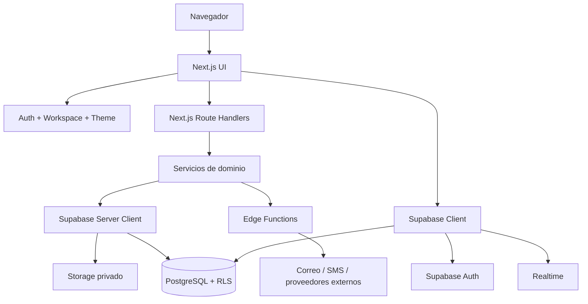
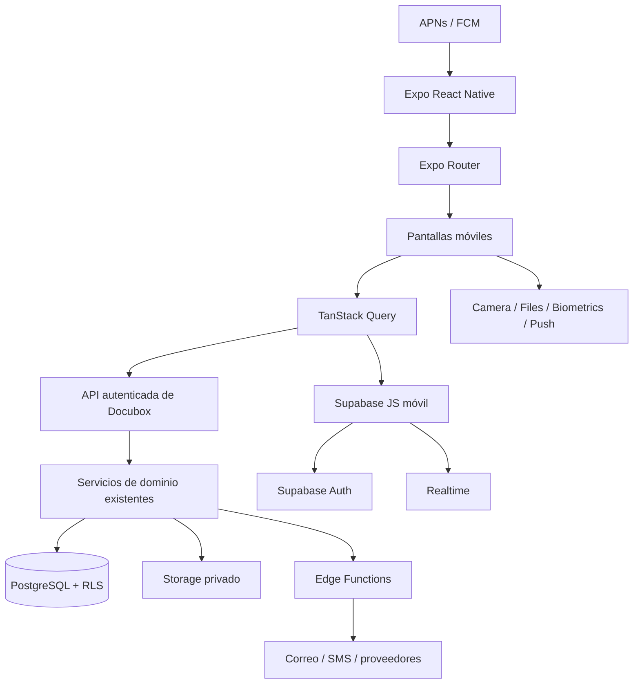

# Arquitectura de la webapp Docubox y adaptación a aplicación móvil

## 1. Objetivo

Este documento describe la arquitectura ya construida en la webapp Docubox y define cómo reutilizarla para una aplicación móvil iOS/Android sin duplicar reglas de negocio, datos, seguridad ni procesos documentales.

La recomendación es construir un nuevo cliente móvil sobre la misma plataforma backend, no envolver la web en un WebView ni crear un backend móvil independiente.

## 2. Arquitectura actual de la webapp

Docubox utiliza un **monolito modular multi-tenant**:

| Capa | Implementación actual |
|---|---|
| Presentación | Next.js App Router, React, TypeScript y Tailwind |
| Shell | TopNav, navegación contextual, tema y selector de workspace |
| Contexto cliente | Auth, Workspace, Theme, Sidebar y capacidades |
| Backend web | Route Handlers de Next.js |
| Dominio | Servicios en `src/lib/**` por contexto funcional |
| Identidad | Supabase Auth |
| Datos | PostgreSQL de Supabase con RLS |
| Archivos | Supabase Storage privado |
| Eventos | Supabase Realtime |
| Procesos backend | Supabase Edge Functions y servicios Next.js |
| Despliegue | Vercel + Supabase |

Dominios base reutilizables:

- autenticación y seguridad;
- workspaces y miembros;
- documentos y versiones;
- participantes y solicitudes;
- firma y evidencias;
- actividad, mensajes, notas y tareas;
- contactos;
- notificaciones;
- organización;
- verificación pública;
- suscripción y consumo.

## 3. Diagrama actual



## 4. Arquitectura móvil objetivo

Stack recomendado:

- React Native con Expo y TypeScript;
- Expo Router;
- TanStack Query para estado remoto;
- estado local reducido con Zustand o Context cuando sea suficiente;
- React Hook Form + Zod;
- Expo SecureStore para tokens no manejados automáticamente;
- Expo Notifications para APNs/FCM;
- Expo Linking para universal links y app links;
- visor PDF nativo maduro;
- captura de firma mediante canvas nativo;
- biometría/passkeys mediante APIs nativas y backend WebAuthn compatible;
- Sentry u OpenTelemetry para observabilidad sin datos documentales.



## 5. Principio de reutilización

La aplicación móvil reutiliza:

- proyecto Supabase;
- usuarios y sesiones;
- workspaces, memberships y roles;
- esquema PostgreSQL;
- RLS;
- buckets y rutas de Storage;
- documentos y versiones;
- estados y transiciones;
- participantes y evidencias;
- Edge Functions;
- proveedores de correo y SMS;
- portal público;
- contratos y validaciones de dominio que sean independientes de Next.js;
- tokens visuales, logotipos y vocabulario del producto.

No reutiliza directamente:

- componentes React DOM;
- Tailwind web como implementación de estilos;
- `window`, cookies o APIs del navegador;
- Route Handlers que dependan exclusivamente de cookies de Next.js;
- editor PDF diseñado para mouse;
- navegación TopNav/Sidebar;
- almacenamiento local del navegador.

## 6. Matriz de adaptación

| Elemento web | Decisión móvil | Modificación requerida |
|---|---|---|
| Supabase Auth | Conservar | PKCE, almacenamiento seguro y deep links |
| PostgreSQL + RLS | Conservar | Añadir pruebas con JWT móvil |
| Workspaces | Conservar | Selector móvil y limpieza de caché por tenant |
| Documentos/versiones | Conservar | Cliente API y paginación móvil |
| Storage privado | Conservar | Endpoints de descarga/streaming autenticados |
| Realtime | Conservar | Reconexión, foreground/background y deduplicación |
| Route Handlers | Extender | Aceptar Bearer token además de sesión por cookie |
| Edge Functions | Conservar/extender | CORS, JWT y contratos versionados |
| Tailwind | Compartir tokens | Implementar tema React Native |
| Componentes web | Rediseñar | Componentes nativos accesibles |
| PDF viewer | Sustituir UI | Motor nativo y endpoint propio |
| Editor de campos | Adaptar | Gestos táctiles, zoom y handles amplios |
| WebAuthn | Adaptar | Passkeys/credenciales de plataforma |
| Email | Conservar | Deep links universales hacia app o web |
| Notificaciones internas | Conservar | Añadir registro APNs/FCM |
| Reportes | Adaptar | Resumen y drill-down, no tablas anchas |
| Organización | Adaptar | Flujos breves y step-up nativo |

## 7. Organización recomendada del repositorio

La opción más sostenible es evolucionar a monorepo sin mover todo de una vez:

```text
apps/
  web/                 # Next.js existente
  mobile/              # Expo React Native
packages/
  domain/              # tipos, estados y reglas puras
  contracts/           # DTO, Zod y contratos API
  api-client/          # cliente autenticado web/móvil
  design-tokens/       # colores, tipografía, espaciado y estados
  telemetry/           # eventos permitidos y sanitización
supabase/
  migrations/
  functions/
docs/
```

Migración incremental recomendada:

1. Crear `apps/mobile` sin mover la web.
2. Extraer contratos que el móvil necesite a `packages/contracts`.
3. Extraer reglas puras comprobadas a `packages/domain`.
4. Crear `packages/api-client` con autenticación por Bearer token.
5. Mover la web a `apps/web` únicamente cuando CI, rutas y despliegue estén preparados.

No extraer componentes visuales web a móvil. Compartir comportamiento y tokens, no JSX dependiente del DOM.

## 8. Frontera API para móvil

La webapp actual combina acceso directo con Supabase y Route Handlers. Para móvil se recomienda una frontera híbrida:

### Acceso directo con Supabase

Solo para operaciones simples protegidas por RLS:

- sesión y perfil básico;
- lectura de workspaces permitidos;
- notificaciones;
- suscripciones Realtime;
- lectura simple que no exponga secretos ni lógica privilegiada.

### API/BFF obligatorio

- crear y enviar documentos;
- generar sesiones de carga;
- reutilizar originales;
- modificar participantes y orden;
- emitir invitaciones y recordatorios;
- firmar;
- cerrar documentos;
- generar constancias;
- descargar artefactos;
- administrar miembros y roles;
- exportar reportes;
- verificar recursos privados;
- cualquier uso de service role o proveedor externo.

## 9. Autenticación móvil

### Sesión

- Usar Supabase Auth con PKCE.
- Guardar únicamente material de sesión requerido en almacenamiento seguro.
- Renovar tokens mediante la librería oficial.
- Invalidar cachés al cerrar sesión o cambiar workspace.
- Implementar timeout absoluto y revocación server-side.

### Autorización API

Cada solicitud móvil protegida envía:

```http
Authorization: Bearer <access_token>
X-Workspace-Id: <workspace_uuid>
X-Request-Id: <uuid>
```

El servidor debe:

1. validar JWT con Supabase;
2. obtener el usuario real;
3. validar membership y rol;
4. validar propiedad o participación sobre el recurso;
5. ejecutar la operación;
6. registrar auditoría.

`X-Workspace-Id` es contexto solicitado, no prueba de autorización.

### Passkeys y biometría

- La biometría local desbloquea una credencial, no reemplaza la autenticación del servidor.
- Usar passkeys/WebAuthn con RP ID y dominios válidos.
- Face ID, Touch ID o PIN nunca salen del dispositivo.
- La revocación elimina la credencial server-side.
- Mantener fallback con OTP/TOTP.

## 10. Contratos API mínimos

Endpoints sugeridos, versionados bajo `/api/mobile/v1` o `/api/v1` compartido:

```text
GET    /me
GET    /workspaces
POST   /workspaces/{id}/activate
GET    /dashboard
GET    /documents
POST   /documents/upload-sessions
POST   /documents
GET    /documents/{id}
GET    /documents/{id}/viewer
GET    /documents/{id}/versions
POST   /documents/{id}/participants
POST   /documents/{id}/send
POST   /documents/{id}/reminders
POST   /documents/{id}/cancel
GET    /documents/{id}/activity
GET    /documents/{id}/messages
POST   /documents/{id}/messages
GET    /documents/{id}/artifacts
GET    /documents/{id}/artifacts/{type}
GET    /participations
GET    /participations/{id}
POST   /participations/{id}/evidence
POST   /participations/{id}/sign/autograph
POST   /participations/{id}/sign/click
POST   /participations/{id}/sign/efirma
GET    /tasks
GET    /contacts
POST   /contacts
GET    /notifications
POST   /notifications/read
POST   /devices/push-token
DELETE /devices/push-token/{id}
GET    /organization/members
POST   /organization/invitations
PATCH  /organization/members/{id}
GET    /public/verifications/{token}
```

Las respuestas deben usar un contrato consistente:

```json
{
  "data": {},
  "error": null,
  "meta": {
    "request_id": "uuid",
    "next_cursor": null
  }
}
```

Los errores incluyen código estable, mensaje humano y `request_id`, nunca stack traces.

## 11. Carga y descarga de documentos

### Carga

Flujo recomendado:

```text
Móvil
  -> solicita upload session
  -> backend valida tenant, cuota y MIME permitido
  -> backend entrega destino temporal autorizado
  -> móvil carga con progreso y reintento
  -> backend valida objeto, malware, tamaño y hash
  -> backend crea original inmutable
```

Para archivos grandes usar carga reanudable o multipart compatible con la infraestructura. No mantener el archivo completo en memoria si puede transmitirse por stream.

### Descarga y visor

- El móvil solicita el artefacto por un endpoint propio.
- El backend valida sesión, workspace, permiso y estado.
- Puede responder por streaming o con URL firmada de duración breve.
- La URL no se registra en analítica ni logs de navegación.
- El visor elimina archivos temporales según expiración y política.

## 12. Estado remoto y caché

TanStack Query debe administrar:

- keys que incluyan `workspaceId`;
- paginación por cursor;
- invalidación tras mutaciones;
- deduplicación de solicitudes;
- reintentos únicamente para operaciones seguras;
- cancelación al cambiar de workspace;
- persistencia limitada y cifrada si se habilita.

Ejemplos:

```text
['workspace', workspaceId, 'dashboard']
['workspace', workspaceId, 'documents', filters]
['workspace', workspaceId, 'document', documentId]
['workspace', workspaceId, 'participations', filters]
['workspace', workspaceId, 'notifications']
```

No almacenar documentos o respuestas sensibles en Zustand. El estado global debe limitarse a sesión presentada, workspace activo, tema y preferencias efímeras.

## 13. Realtime

Canales móviles:

- notificaciones del usuario;
- estado de documentos visibles;
- participantes del documento abierto;
- mensajes del documento abierto;
- resultado de cargas móviles;
- estado de artefactos en generación.

Reglas:

- suscribirse solo en foreground o pantalla relevante;
- cancelar canales al cambiar workspace;
- reconciliar con una consulta al reconectar;
- deduplicar por event id o versión;
- no considerar Realtime fuente autoritativa única.

## 14. Notificaciones push

Agregar tablas o extender las existentes:

```text
push_devices
- id
- user_id
- workspace_id nullable
- platform
- push_token_encrypted o referencia segura
- app_version
- device_name
- enabled
- last_seen_at
- revoked_at
```

Flujo:

1. pedir permiso después de explicar el valor;
2. registrar token en backend;
3. asociarlo al usuario, no confiar en ids del payload;
4. renovar token cuando cambie;
5. eliminarlo al cerrar sesión o revocar dispositivo;
6. enviar payload mínimo;
7. comprobar autorización al abrir el recurso.

## 15. Deep links y universal links

Configurar:

- Associated Domains en iOS;
- App Links en Android;
- `apple-app-site-association`;
- `assetlinks.json`;
- esquema privado para desarrollo.

El mismo enlace HTTPS debe:

- abrir la app si está instalada;
- abrir el portal web si no lo está;
- conservar el token durante autenticación;
- canjearlo una sola vez cuando corresponda;
- no incluir correo, nombre o folio sensible en query params.

## 16. Adaptación de firma

La aplicación móvil captura la intención y evidencia permitida, pero el servidor conserva la autoridad del proceso.

### Autógrafa

- Canvas nativo produce trazo y representación visual.
- El backend verifica turno, versión y participante.
- El cliente envía evidencia con idempotency key.
- El backend persiste y genera el artefacto cerrado.

### Click & Sign

- El backend entrega la versión y hash que se aceptarán.
- El cliente muestra consentimiento y recoge aceptación.
- El backend vuelve a validar hash y estado antes de firmar.

### e.firma

- La app selecciona archivos mediante file picker seguro.
- Los archivos y contraseña no se guardan en AsyncStorage, logs o analytics.
- Se envían a un endpoint seguro únicamente durante la operación o se procesan en un entorno controlado conforme a la arquitectura aprobada.
- El backend valida certificado, llave, vigencia, RFC, turno y hash.

Ningún método puede confiar en el nombre, correo, rol o estado enviados por el cliente sin reconciliarlos con la base de datos.

## 17. Multi-tenant y RLS

Cada recurso debe estar relacionado con `workspace_id` o derivarlo de forma inequívoca.

Políticas necesarias:

- usuario autenticado y miembro activo;
- owner/admin para administración;
- propietario para determinadas mutaciones;
- participante para lectura y firma de su solicitud;
- acceso público solo mediante función o endpoint limitado;
- service role solo en backend.

Pruebas móviles de seguridad:

- usuario A no lee workspace B;
- miembro no ejecuta acción de admin;
- participante no firma por otro;
- token de invitación no abre otro documento;
- workspace header manipulado no concede acceso;
- sesión revocada deja de descargar;
- caché del tenant anterior se elimina al cambiar workspace.

## 18. Seguridad del dispositivo

- SecureStore/Keychain/Keystore para secretos locales permitidos.
- No usar AsyncStorage para access tokens, PDFs o datos de e.firma.
- Ocultar contenido sensible en app switcher cuando corresponda.
- Bloqueo local opcional por biometría después de inactividad.
- Detección de root/jailbreak solo como señal de riesgo, no como única defensa.
- App Attest/DeviceCheck y Play Integrity como defensa adicional para acciones críticas.
- Protección contra capturas únicamente donde el sistema operativo lo permita y exista justificación.
- Borrado de temporales al cerrar sesión, revocar dispositivo o expirar.
- TLS obligatorio. Certificate pinning solo con estrategia de rotación y recuperación documentada.

## 19. Diseño compartido

Crear un paquete de tokens, no un paquete de componentes universales:

```ts
export const colors = {
  primary: '#1E6BFF',
  background: '#F8FAFC',
  surface: '#FFFFFF',
  text: '#18181B',
  textMuted: '#52525B',
  border: '#E2E8F0',
};
```

Compartir:

- colores semánticos;
- escala de espaciado;
- radios;
- vocabulario de estados;
- iconos y logos autorizados;
- reglas de tono y mensajes.

Implementar por separado componentes web y React Native.

## 20. Observabilidad

Cada cliente móvil debe enviar:

- app version;
- build number;
- platform y versión del sistema;
- request_id/trace_id;
- latencia;
- código de resultado;
- conectividad;
- crash reports sanitizados.

No registrar:

- contenido documental;
- contraseñas o OTP;
- tokens;
- URLs firmadas;
- archivos de e.firma;
- firmas manuscritas;
- nombres o correos completos salvo auditoría backend autorizada.

## 21. CI/CD móvil

Pipeline recomendado:

1. typecheck;
2. lint;
3. unit tests;
4. contract tests contra API;
5. pruebas de componentes;
6. E2E móvil;
7. security scan;
8. build firmado;
9. distribución interna;
10. rollout gradual.

Entornos:

- local;
- development;
- staging;
- production.

Cada entorno usa proyecto/configuración separada o controles equivalentes. Nunca apuntar un build de desarrollo a producción de forma implícita.

## 22. Estrategia de implementación

### Fase 1. Fundación

- Expo, navegación, tema, observabilidad y configuración por entorno.
- Supabase Auth, restauración de sesión y workspace.
- Contratos API compartidos.

### Fase 2. Lectura operativa

- Inicio, documentos, detalle, visor, participaciones, tareas y notificaciones.
- Realtime y deep links.

### Fase 3. Creación

- archivos, cámara, carga reanudable, participantes y envío.
- editor táctil de campos.

### Fase 4. Firma

- campos, autógrafa, Click & Sign, e.firma y OTP.
- evidencias y avance secuencial.

### Fase 5. Soporte

- contactos, mensajes, notas, vencimientos, descargas y reportes.

### Fase 6. Cuenta empresarial

- miembros, invitaciones, roles y políticas esenciales.

### Fase 7. Hardening y publicación

- accesibilidad, rendimiento, seguridad, E2E, TestFlight, Play Internal Testing y rollout.

## 23. Pruebas de adaptación obligatorias

- contratos web y móvil producen los mismos estados;
- una operación móvil aparece inmediatamente en la web;
- una operación web se reconcilia correctamente en móvil;
- cambio de workspace limpia datos anteriores;
- invitación por correo abre app o fallback web;
- carga interrumpida continúa sin duplicar original;
- doble toque no duplica envío o firma;
- firma secuencial bloquea participantes fuera de turno;
- revocación web cierra sesión móvil;
- descargas expiran y se eliminan;
- push no expone datos sensibles;
- offline no permite acciones legales;
- RLS funciona con JWT móvil;
- versiones antiguas de la app reciben respuesta compatible o actualización obligatoria.

## 24. Criterios de aceptación arquitectónica

- Web y móvil usan el mismo documento, versión, participante y evidencia.
- No existe una base de datos móvil paralela.
- Las reglas legales permanecen en servidor o dominio compartido comprobado.
- La app no depende de cookies de navegador.
- Todas las operaciones privilegiadas usan API autenticada.
- RLS continúa siendo una segunda barrera de aislamiento.
- Los archivos siguen en Storage privado.
- Los tokens se almacenan de forma segura.
- Deep links y push vuelven a validar permisos.
- La caché está separada por workspace.
- Los módulos excluidos de App Market no aparecen en la aplicación móvil base.
- El cliente móvil puede evolucionar sin duplicar el backend ni romper la webapp.
