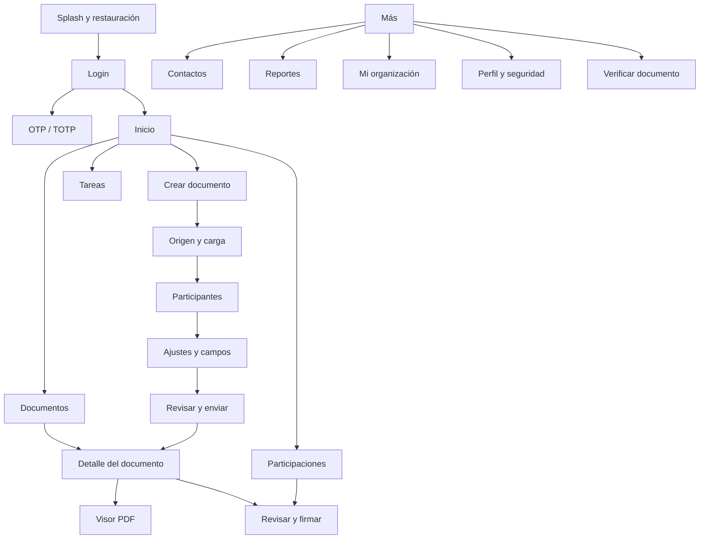

# Docubox móvil: contexto, pantallas y especificación UI/UX

## 1. Propósito

Construir una aplicación móvil nativa para iOS y Android que permita operar las funciones esenciales de Docubox desde un teléfono sin reproducir literalmente la interfaz de escritorio.

La aplicación debe cubrir dos usos principales:

1. **Usuario interno:** consulta, creación, envío, seguimiento y administración documental.
2. **Participante:** revisión y firma de documentos mediante una experiencia breve, guiada y segura.

La aplicación móvil forma parte de la misma plataforma multi-tenant. Comparte usuarios, workspaces, documentos, participantes, estados, evidencias y permisos con la webapp. No crea un repositorio, proceso de firma ni modelo de datos paralelo.

## 2. Alcance

La primera versión móvil incluye:

- autenticación con contraseña, OTP y TOTP;
- passkeys o biometría mediante credenciales del sistema cuando estén disponibles;
- cuenta personal y empresarial;
- selección de espacio de trabajo;
- dashboard;
- documentos y búsqueda;
- creación y envío de documentos;
- participantes y orden de firma;
- mis solicitudes;
- mis participaciones;
- tareas;
- contactos;
- notificaciones push e internas;
- revisión y firma;
- visor documental;
- descargas autorizadas;
- verificación mediante folio o QR;
- perfil, seguridad y dispositivos;
- administración esencial de organización para owner/admin.

Quedan fuera de la aplicación base los módulos instalables de App Market.

## 3. Principios de experiencia

- **Mobile-first real:** controles táctiles de al menos 44 x 44 puntos.
- **Una decisión principal por pantalla:** evita trasladar paneles densos de escritorio.
- **Progreso visible:** todo wizard indica paso, avance y acción siguiente.
- **Contexto persistente:** el workspace y documento activos deben ser evidentes.
- **Mensajes humanos:** cada error explica qué ocurrió y cómo continuar.
- **Seguridad discreta:** informa sin exponer detalles técnicos o secretos.
- **Estados veraces:** nunca mostrar “Firmado”, “Enviado” o “Disponible” antes de confirmación del servidor.
- **Acciones reversibles:** confirmar cancelaciones, rechazos y operaciones destructivas.
- **Continuidad entre canales:** un deep link debe abrir el documento y participante correctos.
- **Accesibilidad:** contraste AA, VoiceOver/TalkBack, tamaños dinámicos y orden de foco.

## 4. Lenguaje visual

La aplicación móvil conserva la identidad visual de la webapp:

| Token | Valor o regla |
|---|---|
| Acento principal | `#1E6BFF` |
| Fondo claro | `#F8FAFC` |
| Superficie | `#FFFFFF` |
| Texto principal | `#18181B` |
| Texto secundario | `#52525B` |
| Borde | `#E2E8F0` |
| Éxito | Verde funcional |
| Advertencia | Ámbar funcional |
| Error | Rojo funcional |
| Tipografía | Google Sans o equivalente autorizado en móvil |
| Radio habitual | 8 px |
| Iconografía | Lucide o familia equivalente consistente |

Reglas:

- No usar gradientes decorativos, orbes ni fondos ilustrativos dentro de la aplicación.
- Usar cards únicamente para documentos, tareas, participantes o unidades repetidas.
- No anidar cards.
- No usar texto excesivamente grande en pantallas operativas.
- Usar bottom sheets para acciones secundarias y confirmaciones contextuales.
- Usar skeletons que conserven el tamaño final de cada vista.
- El tema oscuro debe usar superficies neutrales, no una interfaz dominada por azul.

## 5. Arquitectura de navegación

### Navegación inferior autenticada

La barra inferior contiene cinco destinos:

1. **Inicio**
2. **Documentos**
3. **Participaciones**
4. **Tareas**
5. **Más**

La acción **Crear documento** debe estar disponible como botón destacado en Inicio y Documentos. No se recomienda un botón flotante que tape contenido.

### Encabezado

- Logo o título contextual.
- Selector compacto de workspace.
- Campana de notificaciones.
- Avatar o menú de cuenta.
- Botón Atrás cuando la pantalla pertenece a un flujo.

### Menú Más

- Solicitudes enviadas.
- Contactos.
- Reportes.
- Mi organización, solo para workspace empresarial y rol autorizado.
- Verificar documento.
- Mi perfil.
- Configuración.
- Plan y facturación.
- Centro de ayuda.
- Cerrar sesión.

## 6. Mapa general de pantallas



## 7. Pantallas de acceso y onboarding

### M01. Splash y restauración de sesión

**Objetivo:** restaurar de forma segura la sesión sin mostrar transiciones innecesarias.

Elementos:

- isotipo centrado sin animaciones largas;
- indicador breve de carga;
- validación de sesión, versión mínima y bloqueo remoto;
- redirección a Login, selección de workspace o Inicio.

Estados:

- sin red;
- sesión expirada;
- actualización obligatoria;
- mantenimiento;
- dispositivo revocado.

### M02. Bienvenida

Pantalla opcional para primera instalación. Máximo tres láminas:

- prepara y envía documentos;
- revisa y firma desde cualquier lugar;
- conserva evidencia y seguimiento.

Acciones: `Continuar` y `Ya tengo cuenta`.

### M03. Login

Elementos:

- logotipo;
- correo;
- contraseña con mostrar/ocultar;
- iniciar sesión;
- olvidé mi contraseña;
- ingresar con código OTP;
- ingresar con passkey cuando esté disponible;
- crear cuenta.

Al elegir OTP, la pantalla sustituye el formulario de contraseña por el flujo OTP y muestra `Cambiar método`.

### M04. Código OTP

- correo de destino parcialmente enmascarado;
- seis casillas con pegado automático;
- autocompletado del sistema;
- temporizador real;
- reenviar cuando sea permitido;
- cambiar método;
- prevención de múltiples verificaciones simultáneas.

### M05. Verificación TOTP

- seis dígitos;
- código de recuperación;
- confiar en este dispositivo únicamente si la política lo permite;
- errores con intentos restantes sin revelar datos sensibles.

### M06. Registro

Pasos:

1. tipo de cuenta: personal o empresarial;
2. datos personales;
3. credenciales y aceptación legal;
4. verificación de correo;
5. organización y slug si es empresarial;
6. confirmación.

No incluir invitación de miembros durante el alta. Indicar que se configura después.

### M07. Recuperar contraseña

- correo;
- OTP o enlace seguro;
- contraseña nueva;
- confirmación;
- cierre de otras sesiones opcional;
- resultado y retorno a Login.

## 8. Pantallas principales

### M08. Selector de espacio de trabajo

Se presenta como bottom sheet desde el encabezado.

Cada espacio muestra:

- nombre;
- tipo: Personal o Empresa;
- rol;
- estado Activo;
- check del workspace actual.

Incluye `Unirse a un espacio de trabajo`. El cambio actualiza consultas, permisos y navegación sin conservar datos del tenant anterior en pantalla.

### M09. Inicio

Contenido:

- saludo y workspace activo;
- resumen: pendientes de mi firma, en proceso, completados y próximos a vencer;
- acción principal Crear documento;
- tareas prioritarias;
- documentos recientes;
- actividad reciente;
- acceso a ver todas las notificaciones.

Los indicadores deben ser horizontales y desplazables solo si no caben. No crear una cuadrícula de cards diminutas.

### M10. Búsqueda global

- búsqueda por nombre, folio, participante o contacto;
- resultados agrupados por Documentos, Personas y Tareas;
- historial local eliminable;
- debounce y búsqueda en servidor;
- ningún resultado de otro workspace.

### M11. Centro de notificaciones

- Todas y No leídas;
- icono por tipo;
- título, resumen y tiempo relativo;
- marcar como leída;
- marcar todas;
- deep link al recurso;
- paginación incremental y Realtime.

## 9. Documentos

### M12. Lista de documentos

Encabezado:

- título Documentos;
- búsqueda;
- filtro;
- Crear documento.

Segmentos:

- Todos;
- En proceso;
- Completados;
- Borradores;
- Favoritos;
- Papelera.

Cada fila muestra:

- icono de tipo;
- título;
- folio;
- estado;
- progreso de participantes;
- fecha de actualización;
- menú contextual.

Filtros en bottom sheet: estado, propietario, fecha, carpeta y etiqueta. Orden: modificación, creación o nombre.

### M13. Acciones del documento

Bottom sheet contextual:

- abrir;
- compartir acceso interno;
- favorito;
- mover;
- etiquetar;
- renombrar si está permitido;
- descargar si existe permiso;
- duplicar como derivación;
- cancelar proceso;
- enviar a papelera.

Las acciones dependen del estado y rol. No mostrar opciones deshabilitadas sin explicar por qué.

### M14. Detalle del documento

Cabecera:

- nombre;
- folio;
- estado;
- progreso;
- menú de acciones.

Secciones:

- Vista previa;
- Participantes;
- Próxima acción;
- Actividad reciente;
- Vencimiento;
- Archivos disponibles.

Acciones contextuales: revisar, firmar, recordar, editar o descargar.

### M15. Visor PDF

- PDF a pantalla completa;
- zoom mediante pellizco;
- navegación de páginas;
- miniaturas en bottom sheet;
- búsqueda de página;
- controles que desaparecen al leer;
- botón contextual para campos pendientes;
- watermark cuando corresponda;
- no exponer URL de Storage.

El archivo se obtiene mediante un endpoint autenticado o URL efímera mantenida fuera de la barra de navegación.

## 10. Crear documento

### M16. Wizard: origen y carga

Orígenes:

- Archivos del dispositivo;
- Escanear con cámara;
- Fotos;
- Desde Docubox.

Funciones:

- selección múltiple solo cuando el flujo la soporte;
- carga en segundo plano con progreso;
- cancelación y reintento;
- validación de formato y tamaño;
- vista previa;
- nombre del documento;
- clasificación básica.

Desde Docubox muestra originales únicos y excluye borradores. Acciones por documento: utilizar, ver original e historial de uso.

### M17. Escáner documental

- captura automática de bordes;
- varias páginas;
- recorte, rotación y reordenamiento;
- filtros neutros para legibilidad;
- confirmación antes de crear el PDF;
- no almacenar capturas descartadas.

### M18. Wizard: participantes

- lista ordenable;
- agregar desde contactos o correo;
- nombre, correo, rol, método de firma y canal de notificación;
- paralelo o secuencial;
- indicador `Esperará turno` en secuencial;
- vencimiento y mensaje opcional;
- validación de duplicados.

Usar pantalla completa para editar una persona y bottom sheet para seleccionar contacto.

### M19. Wizard: ajustes y campos

En móvil, el editor debe priorizar precisión:

- PDF en pantalla completa;
- selector de participante por color;
- bandeja inferior de campos;
- tocar para insertar;
- arrastrar y redimensionar con handles amplios;
- zoom bloqueable mientras se mueve un campo;
- firma, nombre, fecha, texto, checkbox e iniciales;
- navegación entre campos;
- validación de campos obligatorios.

Configuración adicional:

- recordatorios;
- vencimiento;
- privacidad pública/privada al completar;
- zona horaria;
- permisos de descarga.

### M20. Wizard: revisar y enviar

- archivo;
- participantes y orden;
- campos por participante;
- vencimiento;
- canales;
- privacidad;
- aceptar confirmación final;
- enviar.

Al enviar, mostrar progreso real y resultado. Evitar doble toque y envíos duplicados.

## 11. Solicitudes, participaciones y tareas

### M21. Solicitudes enviadas

Segmentos: En proceso, Completadas, Vencidas y Canceladas.

Cada elemento muestra documento, avance, participante actual, fecha y vencimiento. Acciones: abrir, recordar o cancelar según permisos.

### M22. Mis participaciones

Segmentos:

- Por firmar;
- Esperando turno;
- Firmadas;
- Rechazadas;
- Vencidas.

La acción principal debe ser `Revisar y firmar`, `Ver documento` o `Descargar mi constancia` según el estado.

### M23. Tareas

Segmentos: Pendientes, Próximas, Completadas y Vencidas.

Cada tarea muestra prioridad, título, documento, solicitante, vencimiento y acción. Deslizar puede marcar como leída, pero no debe completar acciones legales sin confirmación.

## 12. Firma móvil

### M24. Preparación para firma

- identidad del documento;
- solicitante;
- rol;
- método requerido;
- checklist: revisar, completar campos, aceptar y firmar;
- acceso a ayuda;
- continuar.

### M25. Completar campos

- navegación `Anterior` y `Siguiente campo`;
- foco automático;
- teclado adecuado al tipo;
- resumen de campos pendientes;
- guardado en servidor o borrador cifrado temporal según política.

### M26. Firma autógrafa

- canvas de alta resolución;
- orientación horizontal opcional;
- Deshacer, Limpiar y Confirmar;
- nombre del firmante;
- consentimiento visible;
- vista previa exacta de la estampa seleccionada;
- la estampa solo se coloca en el campo asignado.

### M27. Click & Sign

- resumen del consentimiento;
- versión y hash del documento;
- checkbox no preseleccionado;
- `Firmar y aceptar`;
- confirmación OTP si la política lo requiere;
- resultado firmado.

### M28. e.firma

- selector de `.cer`;
- selector de `.key`;
- contraseña en campo seguro;
- validación previa;
- titular, RFC, serie y vigencia obtenidos realmente;
- consentimiento;
- firmar.

Los archivos sensibles y contraseña solo viven durante la operación y se eliminan del almacenamiento temporal. No respaldarlos ni registrarlos en analytics.

### M29. OTP de firma

- código de seis dígitos;
- contexto del documento;
- expiración;
- reenviar;
- cancelar sin firmar.

### M30. Firma completada

- confirmación solemne y clara;
- fecha y folio;
- estado del proceso;
- descargar mi constancia cuando esté lista;
- volver a Participaciones.

## 13. Comunicación y seguimiento

### M31. Participantes del documento

- nombre, rol, método, turno y estado;
- fecha de invitación, visualización y firma cuando esté permitido;
- recordar;
- descargar únicamente la constancia del usuario autenticado.

### M32. Mensajes

- hilo del documento;
- mensajes en tiempo real;
- adjuntos solo si la política lo permite;
- estado vacío;
- indicador de envío y error;
- participantes visibles en el encabezado sin mezclarse con el título.

### M33. Actividad y auditoría

- timeline vertical;
- icono, acción, actor, fecha y detalle;
- filtros;
- eventos posteriores al cierre se consultan en vivo, pero no modifican la constancia de auditoría cerrada.

### M34. Vencimientos

- fecha y zona horaria;
- estado;
- programación de recordatorios;
- editar o extender según permisos;
- confirmación y auditoría.

### M35. Notas

- lista y creación;
- privadas o compartidas;
- autor y fecha;
- edición y eliminación controladas;
- estado vacío.

### M36. Descargas

- original;
- PDF final firmado;
- constancia general;
- mi constancia individual;
- constancia de auditoría;
- XML y paquete de evidencia cuando estén disponibles.

Cada artefacto muestra estado: Generando, Disponible o Falló. La descarga usa almacenamiento temporal seguro del sistema y opción de compartir nativa.

## 14. Contactos, reportes y organización

### M37. Contactos

- búsqueda;
- personales y del workspace;
- crear, editar, archivar y etiquetar;
- nombre, correo, teléfono, organización y datos fiscales opcionales;
- deduplicación.

### M38. Reportes

- resumen de periodo;
- documentos enviados y completados;
- tiempo promedio;
- vencimientos;
- métodos de firma;
- filtros;
- detalle en lista;
- exportación solicitada al backend y compartida como archivo.

No intentar replicar grandes tablas de escritorio. Priorizar indicadores y drill-down.

### M39. Mi organización

Para owner/admin:

- perfil;
- miembros;
- invitaciones;
- unidades y cargos;
- roles y permisos;
- políticas básicas;
- auditoría administrativa.

Las configuraciones complejas pueden abrir pantallas dedicadas, nunca formularios interminables en un solo scroll.

### M40. Miembro de organización

- datos;
- estado;
- rol;
- unidad;
- permisos efectivos;
- sesiones recientes permitidas;
- suspender, cambiar rol o retirar con step-up y confirmación.

## 15. Perfil, seguridad y configuración

### M41. Perfil

- foto o iniciales;
- nombre y datos de contacto;
- zona horaria e idioma;
- preferencias de notificación;
- firma autógrafa predeterminada;
- tema;
- cerrar sesión.

### M42. Seguridad de la cuenta

- cambiar contraseña;
- TOTP;
- passkeys y biometría;
- dispositivos registrados;
- sesiones activas;
- actividad de acceso;
- códigos de recuperación.

La revocación debe eliminar o desactivar la credencial en servidor y actualizar la lista de inmediato.

### M43. Configurar TOTP

- selección Google Authenticator o Microsoft Authenticator;
- logotipos oficiales;
- enlaces y QR de descarga para iOS/Android;
- instrucciones de instalación;
- QR de enrolamiento;
- código de verificación;
- códigos de recuperación.

No confundir el QR para descargar la aplicación con el QR secreto de enrolamiento.

### M44. Dispositivos y passkeys

- registrar este dispositivo;
- nombre editable;
- tipo y fecha;
- último uso;
- revocar;
- explicación de que Face ID, Touch ID o PIN permanecen en el dispositivo.

### M45. Configuración

- preferencias generales;
- notificaciones;
- seguridad;
- comportamiento de documentos;
- políticas del workspace según rol;
- privacidad y datos;
- ayuda y versión de la app.

### M46. Plan y facturación

- plan actual;
- consumo;
- límites;
- facturas;
- datos fiscales;
- gestionar plan mediante flujo web seguro si la tienda o política lo requiere.

No mostrar catálogo de módulos.

## 16. Verificación móvil

### M47. Verificar documento

- escanear QR;
- capturar folio;
- pegar identificador;
- permisos de cámara solo cuando se use el escáner.

### M48. Resultado de verificación

- estado de integridad;
- título;
- folio;
- fecha de cierre;
- participantes contabilizados;
- hash completo con acción Copiar;
- eventos públicos;
- ver documento únicamente si es público y completado;
- mensaje de documento privado en caso contrario.

## 17. Estados globales

Todas las pantallas deben contemplar:

- cargando;
- vacío;
- sin conexión;
- sesión expirada;
- permiso insuficiente;
- error recuperable;
- error definitivo;
- contenido desactualizado;
- operación en segundo plano;
- éxito.

Las mutaciones deben usar actualización optimista solo cuando sea reversible. Firma, envío, cancelación, cierre y revocación deben esperar confirmación del servidor.

## 18. Comportamiento offline

- Permitir consulta de metadatos previamente cargados, claramente marcados como offline.
- No permitir firma, envío, cierre, cambios de rol ni verificación definitiva sin red.
- No conservar PDFs sensibles en caché permanente por defecto.
- Si se habilita descarga offline, cifrarla y permitir borrado remoto o por expiración.
- Encolar únicamente acciones no legales y reintentables, como marcar notificación leída.

## 19. Notificaciones push y deep links

Eventos push:

- invitación a participar;
- recordatorio;
- turno disponible;
- documento completado;
- vencimiento próximo;
- comentario nuevo;
- cambio sensible de seguridad.

Cada push debe contener un identificador opaco, no información sensible. Al abrir:

1. restaurar sesión;
2. seleccionar o validar workspace;
3. volver a comprobar permisos;
4. solicitar el recurso;
5. abrir la pantalla exacta.

Deep links mínimos:

```text
docubox://documents/{id}
docubox://participations/{id}
docubox://sign/{id}
docubox://tasks/{id}
docubox://verify/{token}
https://[DOMINIO]/portal-participante/{token}
```

## 20. Analítica y privacidad

Registrar eventos de producto sin contenido documental:

- login_success;
- workspace_changed;
- document_upload_started/completed/failed;
- invitation_sent;
- signature_started/completed/failed;
- artifact_downloaded;
- verification_completed.

No enviar a analítica:

- nombres de documentos;
- correos completos;
- contenido de campos;
- hashes completos;
- tokens;
- archivos;
- certificados o credenciales.

## 21. Criterios de aceptación UI/UX

- Las funciones principales son accesibles con una mano en teléfonos comunes.
- Ningún texto o botón se corta con tamaño de fuente aumentado.
- La aplicación funciona en modo claro y oscuro.
- El workspace activo siempre es identificable.
- El participante puede completar una firma sin entrar a menús internos.
- Los estados secuencial y paralelo son comprensibles.
- Los documentos sensibles no quedan visibles en el selector de aplicaciones.
- Una acción legal no se ejecuta dos veces por doble toque o reconexión.
- Los deep links abren el recurso correcto después de autenticar.
- VoiceOver y TalkBack pueden recorrer todos los flujos críticos.
- Las pantallas tienen skeleton, vacío, error y reintento coherentes.
- La interfaz móvil conserva la identidad visual de la web sin copiar su densidad.
