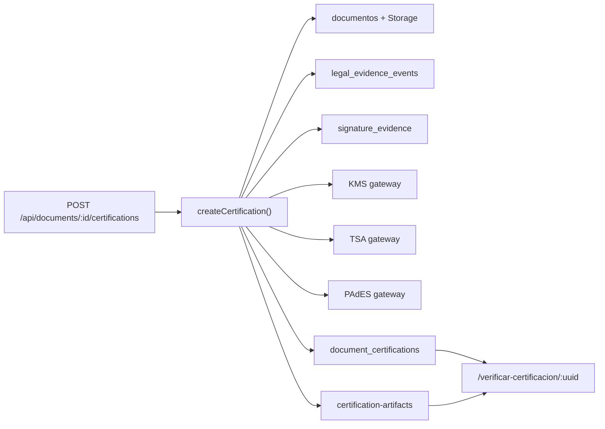

# Inventario actual del motor criptografico

Fecha de corte: 2026-08-08

## Alcance y metodo

Este inventario se obtuvo por inspeccion estatica del repositorio y consultas REST de solo lectura contra el proyecto Supabase configurado localmente. No se modifico codigo de produccion, no se ejecutaron migraciones y no se desplegaron funciones durante esta fase.

Hay dos estados que deben distinguirse:

- **Repositorio:** contiene un motor de certificacion y migraciones nuevas aun no desplegadas.
- **Supabase remoto:** conserva el esquema historico; las tablas principales del motor nuevo no estaban disponibles por REST al momento de la revision.

## Flujo de certificacion existente

La implementacion mas cercana a `CertificationOrchestrator` es `createCertification()` en `src/lib/certification/engine.ts:243`.

Responsabilidades que ya ejecuta:

1. Autentica al solicitante mediante `requireApiUser()` en `src/lib/certification/auth.ts:5`.
2. Comprueba que `documentos.estado = 'completado'` en `src/lib/certification/engine.ts:256`.
3. Crea o reutiliza `document_certifications` con una clave de idempotencia en `src/lib/certification/engine.ts:259`.
4. Descarga el PDF desde Storage en `src/lib/certification/engine.ts:124`.
5. Calcula SHA-256 del documento en `src/lib/certification/engine.ts:308`.
6. Recupera `legal_evidence_events`, `signature_evidence` y `nom151_constancias_doc` en `src/lib/certification/engine.ts:310`.
7. Verifica continuidad de la bitacora legal en `inspectLegalEvidenceChain()` de `src/lib/certification/engine.ts:54`.
8. Construye cadena de documento, manifiesto y cadena de evidencia con JCS en `src/lib/certification/engine.ts:373`.
9. Solicita sellos KMS en `src/lib/certification/engine.ts:402` y `src/lib/certification/engine.ts:464`.
10. Solicita timestamp RFC 3161 en `src/lib/certification/engine.ts:481`.
11. Genera una constancia tecnica con `generateIntegrityCertificatePdf()` en `src/lib/certification/pdf.ts`.
12. Anexa la constancia al documento mediante `appendCertificatePages()` en `src/lib/certification/pdf.ts`.
13. Solicita PAdES-B-T en `src/lib/certification/engine.ts:576`.
14. Genera reporte y paquete tecnico ZIP en `src/lib/certification/engine.ts:580`.
15. Almacena artefactos en `certification-artifacts` sin sobrescritura en `src/lib/certification/engine.ts:197`.
16. Registra transiciones y accesos en `certification_state_transitions` y `certification_access_logs`.
17. Verifica publicamente hashes, sellos y cadena legal en `getPublicCertification()` de `src/lib/certification/engine.ts:714`.

## Componentes criptograficos

| Capacidad | Implementacion | Estado observado |
|---|---|---|
| SHA-256 central | `sha256Hex()` en `src/lib/certification/canonical.ts:33` | Reutilizable |
| Canonicalizacion | `canonicalizeRFC8785()` en `src/lib/certification/canonical.ts:29` | Reutilizable con pruebas RFC adicionales |
| Sello KMS | `signDigestWithKms()` en `src/lib/certification/adapters.ts:39` | Fail-closed; verifica RSA-PSS localmente |
| Timestamp | `requestVerifiedTimestamp()` en `src/lib/certification/adapters.ts:105` | Fail-closed; confia en banderas del gateway |
| PAdES | `signPdfWithPades()` en `src/lib/certification/adapters.ts:153` | Fail-closed; no verifica el PDF localmente |
| Constancia visual | `src/lib/certification/pdf.ts` | Reutilizable |
| Paquete tecnico | `src/lib/certification/zip.ts` | Reutilizable |
| Portal publico | `src/app/verificar-certificacion/[verificationUuid]/page.tsx` | Implementado |
| API certificacion | `src/app/api/documents/[documentId]/certifications/route.ts` | Implementada, ejecucion sincrona |
| Descargas privadas | rutas `certificate`, `certified-pdf` y `package` bajo la API de certificaciones | Owner-only actualmente |

## Implementaciones PAdES coexistentes

1. **Motor nuevo:** `src/lib/certification/adapters.ts` usa gateways KMS/TSA/PAdES y falla cerrado.
2. **Edge Function visual:** `supabase/functions/seal-pdf/index.ts:462` declara que no aplica firma criptografica y entrega PDF visual + hash, aunque su texto y metadatos hablan de PAdES y DigiCert.
3. **VPS pyHanko:** `vps/signer/pades_core.py` firma con una llave PEM local, usa `HTTPTimeStamper` y expone `/sign` y `/verify` desde `vps/signer/server.py`.
4. **Puente Edge/VPS:** `supabase/functions/sign-pdf-vps/index.ts` llama al VPS y persiste el PDF resultante.
5. **Generador inseguro retirado:** `supabase/functions/generate-docubox-cert/index.ts` responde `410 INSECURE_KEY_GENERATOR_RETIRED`.

Estas rutas no son equivalentes y hoy pueden producir afirmaciones tecnicas distintas.

## Persistencia reutilizable

### Documento operativo

- `public.documentos`: entidad usada por la UI y por el motor nuevo. Definida originalmente en `supabase/migrations/20260326210000_documentos_table.sql` y extendida por migraciones posteriores.
- `public.documents`: modelo legal historico definido en `supabase/migrations/20260330080000_docubox_documents_and_evidence.sql:33`. Lo usan servicios heredados como `sign-pdf-vps` y `nom151-generate`.
- No existe una tabla universal e inmutable de versiones del documento. `case_file_document_versions` solo cubre expedientes.

### Evidencia y auditoria

- `signature_evidence`: evidencia biometrica, autografa y tecnica; `supabase/migrations/20260511230000_signature_evidence_table.sql:4`.
- `document_evidence`: contexto de red, dispositivo, geolocalizacion y hash; `supabase/migrations/20260330080000_docubox_documents_and_evidence.sql:153`.
- `document_audit_trail`: auditoria legal inmutable con secuencia y hash anterior; `supabase/migrations/20260330080100_docubox_audit_trail.sql:34`.
- `document_integrity_log`: cadena de integridad verificable; `supabase/migrations/20260330080200_docubox_integrity_log.sql:36`.
- `document_activity_log`: bitacora funcional de UI; `supabase/migrations/20260508070000_document_activity_log.sql:9`.
- `legal_evidence_events`: ledger canonico propuesto por la migracion local `20260808120000_security_integrity_hardening.sql:65`; aun no confirmado en remoto.

### Certificacion

- `document_certifications`: registro central propuesto; migracion `20260805010000_cryptographic_certification_engine.sql:3`.
- `evidence_manifests` y `evidence_manifest_items`: manifiesto canonico y sus elementos.
- `timestamp_records`: artefactos y metadatos RFC 3161.
- `cryptographic_keys`: solo material publico, huellas y procedencia de llaves.
- `certification_state_transitions`: historial inmutable de estados.
- `certification_access_logs`: accesos y verificaciones.
- `document_signature_seals`: sello historico por firmante; no equivale a certificacion institucional.
- `nom151_constancias` y `nom151_constancias_doc`: dos generaciones de persistencia NOM-151.

## Storage

Buckets remotos observados como privados:

- `biometrics`
- `documents`
- `efirma-vault`
- `evidence`
- `mobile-uploads`
- `session-captures`
- `signatures`

Buckets requeridos por las migraciones locales y no observados en remoto:

- `certification-artifacts`
- `documents-signed`
- `nom151-constancias`

La migracion local de endurecimiento los define como privados y agrega politicas por documento.

## Interfaz existente

La tarjeta **Integridad y Evidencia Digital** ya existe en `src/app/visor-documento/[id]/page.tsx:4929`. Muestra disponibilidad de KMS/TSA/PAdES, estado de certificacion, errores y descargas. Debe evolucionar; no debe crearse una pantalla paralela.

El portal publico especializado esta en `src/app/verificar-certificacion/[verificationUuid]/page.tsx`. El repositorio de verificacion general tambien consulta certificaciones desde `src/lib/public-verification/repository.ts:56`.

## Configuracion y secretos

- Los gateways nuevos esperan `DOCUBOX_KMS_GATEWAY_URL`, `DOCUBOX_TSA_GATEWAY_URL`, `DOCUBOX_PADES_GATEWAY_URL` y opcionalmente `DOCUBOX_CRYPTO_GATEWAY_TOKEN` en `src/lib/certification/adapters.ts`.
- Ninguna de esas variables esta presente en el archivo local inspeccionado.
- No se encontraron archivos `.key`, `.p12`, `.pfx` o `.pem` fisicos dentro del repositorio.
- `vps/certs/` esta ignorado por `vps/.gitignore`.
- `generate_p12.sh` contiene una contrasena de ejemplo fija y propone almacenar un PKCS#12 en Supabase Vault. Esa estrategia no satisface el objetivo de custodia KMS/HSM.
- `vps/signer/cert_loader.py` carga una llave PEM desde disco sin passphrase.
- `vps/signer/pades_core.py` recibe una service-role key de Supabase, ampliando innecesariamente el privilegio del firmador.

## Pruebas existentes

- `src/lib/certification/canonical.test.ts`: orden canonico, Unicode, mutacion de valor y cambio de un byte.
- `src/lib/public-verification/repository.test.ts`: repositorio de verificacion publica.
- No hay pruebas automatizadas del orquestador, gateways, PAdES, RFC 3161, aislamiento tenant o recuperacion de fallos.

## Estado remoto relevante

La comprobacion anonima del remoto mostro lectura publica de datos sensibles en tablas de identidad heredadas. La migracion local `20260808115900_emergency_public_policy_lockdown.sql` prepara el cierre, pero no se aplico por falta de sesion/autorizacion de administracion. Este riesgo es independiente del orquestador y debe corregirse antes de habilitar certificacion productiva.

Las tablas `document_certifications`, `signature_otp_challenges`, `legal_evidence_events` y varios modulos nuevos respondieron como esquema ausente por REST. Por tanto, el codigo nuevo existe en el repositorio, pero no puede considerarse operativo en produccion.

