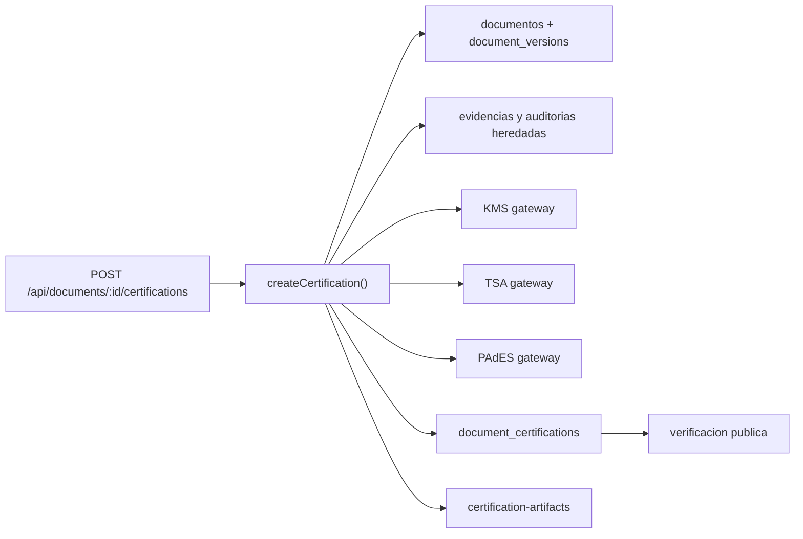

# Inventario actual de infraestructura criptografica

Fecha de corte: 2026-08-17

## Alcance y metodo

Auditoria estatica del repositorio `C:\proyectos\docubox` y consultas de solo lectura al proyecto Supabase `kbjejiclhgjmiasauxyr`. No se modifico codigo, no se instalaron dependencias y no se ejecutaron migraciones ni despliegues.

El sistema contiene dos dominios relacionados pero distintos:

1. **Motor tecnico documental**: `src/lib/certification`, responsable de cadenas, sellos KMS, timestamp, constancia, PAdES y verificacion publica.
2. **Producto Docubox Certifica**: `src/lib/certifica` y `src/app/certificaciones`, responsable de expedientes comerciales de certificacion, productos, cobro, PSC y custodia.

No deben fusionarse sus tablas ni declarar que el segundo sustituye la verificacion criptografica del primero.

## Flujo tecnico existente

La implementacion mas cercana al orquestador solicitado es `createCertification()` en `src/lib/certification/engine.ts:243`.

| Responsabilidad | Implementacion exacta | Estado |
|---|---|---|
| Autenticacion API | `requireApiUser()` en `src/lib/certification/auth.ts` | Reutilizable |
| Documento concluido | Validacion de `documentos.estado` en `engine.ts` | Parcial |
| Idempotencia | Consulta por `document_id` y `document_version` en `engine.ts:259` | Parcial; fija version 1 |
| SHA-256 | `sha256Hex()` en `src/lib/certification/canonical.ts:36` | Reutilizable |
| Canonicalizacion | `canonicalizeRFC8785()` en `canonical.ts:32` | Reutilizable con mas vectores |
| Cadena y manifiesto | `canonicalSha256()` y ensamblado en `engine.ts` | Reutilizable |
| Firma RSA-PSS | `signDigestWithKms()` en `src/lib/certification/adapters.ts:50` | Fail-closed, contrato ambiguo digest/mensaje |
| Timestamp | `requestVerifiedTimestamp()` en `adapters.ts:99` | Delega validacion al gateway |
| Constancia PDF | `generateIntegrityCertificatePdf()` en `src/lib/certification/pdf.ts:185` | Reutilizable |
| Insercion visual | `applyCryptographicPlacements()` y `appendCertificatePages()` | Reutilizable |
| PAdES | `signPdfWithPades()` en `adapters.ts:146` | Delega firma y validacion al gateway |
| Artefactos | `uploadArtifact()` en `engine.ts:197`, bucket `certification-artifacts` | Privado, `upsert:false` |
| Estado/auditoria | `transition()` en `engine.ts:151` | No atomico |
| Portal publico | `getPublicCertification()` en `engine.ts:714` y `/verificar-certificacion/[verificationUuid]` | Parcialmente verificable |

## Producto Docubox Certifica

El modulo nuevo esta en:

- Dominio y productos: `src/lib/certifica/domain.ts`.
- Proveedores: `SandboxCertificationProvider` y `HttpPscCertificationProvider` en `src/lib/certifica/provider.ts`.
- Auditoria de casos: `appendCertificationEvent()` en `src/lib/certifica/server.ts:26`.
- APIs: `src/app/api/certifica/cases`, `upload`, `analyze`, `submit` y `configuration`.
- Portal publico: `src/app/api/public/certifica/[token]/route.ts` y `src/app/verificar-certificacion/c/[token]`.
- Migraciones: `20260817044200_docubox_certifica_phase1.sql`, `20260817051500_docubox_certifica_hardening.sql` y `20260817054000_docubox_certifica_api_hardening.sql`.

El proveedor sandbox marca `legal_validity: false` y `NO VALIDO / DEMOSTRACION` en `provider.ts:30-61`. El proveedor HTTP valida estructura minima de la respuesta, no sus artefactos criptograficos (`provider.ts:86-103`). El analizador solo detecta `/ByteRange` y `/Contents` por expresion regular (`analyze/route.ts:24-25`). La consulta publica compara hashes almacenados entre si, sin volver a descargar y verificar el archivo (`public/certifica/[token]/route.ts:20`).

## Persistencia remota confirmada

### Documento y version

- `public.documentos`: entidad operativa principal.
- `public.documents`: entidad legal historica usada por servicios heredados.
- `public.document_versions`: ya existe; contiene `workspace_id`, `document_id`, `version_number`, `status`, `storage_path`, `sha256`, `source_version_id`, `frozen_at` y `signed_at`. Fue creada en `20260816120000_colabora_tasks_and_reviews.sql:49`.
- La version evita mutaciones cuando esta congelada, enviada o firmada mediante `prevent_frozen_document_version_mutation()`.
- `document_certifications` no tiene `document_version_id`; conserva solo `document_version integer`. No existe FK que pruebe la version exacta certificada.
- La lectura de `document_versions` depende hoy del entitlement `collaboration_advanced_reviews`, lo cual acopla versionado juridico a Colabora.

### Certificacion tecnica

- `document_certifications`: cadenas, sellos, hashes, rutas, entorno y metadatos de proveedor.
- `evidence_manifests` y `evidence_manifest_items`: manifiesto tecnico.
- `timestamp_records`: TSQ/TSR/token, imprint, TSA y validacion.
- `cryptographic_keys`: material publico, certificado, cadena, huellas y attestation; no tiene columna de llave privada.
- `certification_state_transitions` y `certification_access_logs`: trazabilidad del motor.
- No existe `crypto_provider_configurations`; `psc_providers` cubre PSC comerciales, no KMS/PAdES/TSA tecnicos por tenant.

### Casos Certifica

- `certification_cases`, `certification_files`, `certification_manifests`, `certification_evidences`, `certification_case_events`, `certification_provider_transactions`, `certification_public_links` y `certification_verification_runs`.
- `certification_cases.existing_document_certification_id` puede enlazar el caso comercial con `document_certifications`.
- Sus escrituras autenticadas directas fueron revocadas; las mutaciones pasan por backend con `service_role`.
- Archivos, evidencias, manifiestos y eventos tienen triggers de inmutabilidad.

### Evidencia y auditoria heredada

Coexisten `signature_evidence`, `document_evidence`, `document_audit_trail`, `document_integrity_log`, `document_activity_log`, `legal_evidence_events`, `organization_audit_events` y `certification_case_events`. Deben normalizarse mediante adaptadores; no conviene copiarlos a una tabla nueva sin mapa de procedencia.

## Storage remoto

Buckets relevantes confirmados como privados:

- `documents`, `documents-signed`, `evidence`.
- `certification-artifacts`.
- `certification-originals`, `certification-provider-evidence`, `certification-generated-reports`, `certification-temporary-uploads`.

La separacion de buckets es util, pero falta una politica comun de rutas versionadas, retencion, legal hold y reconciliacion de objetos huerfanos.

## Implementaciones PDF/PAdES coexistentes

1. `src/lib/certification/adapters.ts`: gateway fail-closed; no verifica localmente CMS, ByteRange ni RFC 3161.
2. `supabase/functions/seal-pdf/index.ts`: agrega constancia visual y hash; `cryptoSignatureApplied = false`, aunque imprime PAdES/DigiCert/Docubox CA.
3. `vps/signer/pades_core.py`: pyHanko, PEM local sin passphrase y TSA HTTP configurable.
4. `supabase/functions/sign-pdf-vps/index.ts`: puente autenticado al VPS.
5. `supabase/functions/generate-docubox-cert/index.ts`: retirado; responde HTTP 410.

## Edge Functions y autenticacion

Supabase reporta 24 Edge Functions con `verify_jwt=false`. Las funciones criticas inspeccionadas implementan controles propios:

- `sign-pdf-vps` valida JWT con `auth.getUser()`.
- `seal-pdf` valida JWT y acceso al documento.
- `sign-efirma` valida JWT, participante y proveedor obligatorio.
- `nom151-generate` exige `INTERNAL_API_TOKEN`.

El flag global sigue siendo deuda operativa: cada funcion debe tener prueba de contrato de autenticacion porque Supabase no la impone automaticamente.

## Secretos y llaves

- No se encontraron llaves privadas fisicas en el working tree.
- `vps/certs/` esta documentado como ignorado.
- `vps/signer/cert_loader.py:43-44` carga PEM de disco con `key_passphrase=None`.
- `sign-efirma` recibe `.key` cifrada y contrasena en memoria y las transmite al gateway (`index.ts:108-114`); no se observo persistencia, pero faltan pruebas de redaccion de logs y cero retencion.
- El firmador VPS usa una credencial Supabase de servicio para persistir resultados; viola minimo privilegio.
- Los gateways tecnicos usan un token opcional en `adapters.ts:27-35`; debe ser obligatorio o sustituido por identidad de workload/mTLS.

## Pruebas existentes

- `src/lib/certification/canonical.test.ts`: cuatro pruebas basicas.
- `src/lib/certifica/domain.test.ts`: manifiesto y modo sandbox.
- `src/lib/certifica/provider.test.ts`: proveedor sandbox.
- No hay pruebas integrales de orquestacion, PAdES, RFC 3161, KMS, concurrencia, recuperacion, RLS multi-tenant ni verificacion publica criptografica.

## Conclusion del inventario

Docubox tiene una base reutilizable amplia y el esquema remoto ya contiene las tablas principales. Aun no existe una cadena de confianza productiva demostrable: falta ligar certificaciones a versiones inmutables por FK, unificar contratos criptograficos, validar independientemente PAdES/RFC 3161, separar llaves del firmador y convertir el flujo sincrono en una saga durable.
