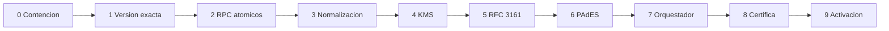

# Plan de migracion

Fecha de corte: 2026-08-17

No ejecutar ningun paquete sin aprobacion explicita. Cada paquete es aditivo, reversible por feature flag y verificable. No se elimina funcionalidad ni historial.

## Estado base confirmado

- Las migraciones de certificacion tecnica, hardening y Docubox Certifica estan aplicadas remotamente.
- Existen `document_versions`, `document_certifications`, `timestamp_records`, `cryptographic_keys`, tablas de evidencia y casos Certifica.
- Los buckets tecnicos y comerciales de certificacion son privados.
- No existe `crypto_provider_configurations`.
- Supabase Advisor conserva hallazgos de `search_path`, `SECURITY DEFINER` y politicas multiples.

## Paquete 0 - Linea base y contencion

Sin cambiar firmas:

- Congelar contratos y fixtures de e.firma, autografa, OTP, `seal-pdf`, `sign-pdf-vps` y NOM-151.
- Eliminar de salidas nuevas cualquier afirmacion PAdES/TSA cuando `cryptoSignatureApplied=false`.
- Probar autenticacion propia de las 24 Edge Functions con `verify_jwt=false`.
- Corregir primero funciones `SECURITY DEFINER` expuestas y `search_path` mutable relacionadas con documentos/certificacion.
- Inventariar secretos y escanear historial Git.

Criterio: cero afirmaciones criptograficas falsas y contratos de regresion verdes.

## Paquete 1 - Version exacta

Migracion aditiva:

- Agregar `document_certifications.document_version_id` nullable con FK `NOT VALID`.
- Agregar `certification_cases.source_document_version_id` nullable.
- Backfill por `document_id`, hash y `version_number`; los casos ambiguos pasan a revision.
- Validar constraints despues del informe de backfill.
- Agregar unique parcial por tenant/version para certificaciones activas.
- Desacoplar lectura de `document_versions` del addon Colabora cuando el usuario tenga permiso documental/certificador.

Rollback: dejar columnas sin uso; no borrar versiones.

## Paquete 2 - RPCs atomicos y auditoria

- Crear RPC `claim_document_certification` con idempotencia, lease y version/hash esperado.
- Crear RPC `transition_document_certification` que escriba estado y evento en una transaccion.
- Crear RPC `append_certification_case_event` que asigne secuencia y hash bajo lock.
- Agregar `attempt_count`, `current_stage`, `lease_owner`, `lease_expires_at`, `failed_at` y error sanitizado.
- Corregir/revocar `SECURITY DEFINER` innecesarios y fijar `search_path`.

Criterio: dos solicitudes concurrentes producen un solo claim y una cadena de eventos continua.

## Paquete 3 - Normalizacion criptografica

- Declarar `canonicalizeRFC8785()` y `sha256Hex()` como utilidades autoritativas.
- Sustituir `stableStringify()` y SHA duplicado de Certifica.
- Versionar schemas de cadena original, evidencia y manifiesto.
- Crear adaptadores de `signature_evidence`, `document_evidence`, auditorias y NOM-151.
- No copiar PII innecesaria ni borrar tablas historicas.

Criterio: mismos bytes canonicos en Node, proveedor y fixtures externos.

## Paquete 4 - Configuracion y KMS de desarrollo

- Crear `crypto_provider_configurations` sin secretos directos.
- Implementar contratos de proveedores.
- Integrar OpenBao Transit en desarrollo con RSA-3072 y dos llaves por proposito.
- Exigir autenticacion de gateway y registrar attestation/key version.
- Calcular fingerprint X.509 sobre DER.
- Retirar la credencial Supabase y PEM local del camino objetivo de firma.

Criterio: firma/verificacion interoperable, llave no exportable y aislamiento por tenant/entorno.

## Paquete 5 - Verificador RFC 3161

- Generar TSQ y conservar request/response/token en `timestamp_records`/Storage.
- Validar ASN.1/CMS, imprint, nonce, policy, firma, certificado, EKU, cadena y vigencia.
- No aceptar `token_signature_valid` como prueba suficiente.
- Separar claramente RFC 3161 de NOM-151.

Criterio: token valido aceptado y cada mutacion negativa rechazada.

## Paquete 6 - PAdES remoto

- Mantener pyHanko, pero adaptar firma al proveedor de llaves no exportable.
- Definir contrato de firma remota/CMS y perfil B-T.
- Quitar acceso directo a Supabase del firmador.
- Ejecutar verificador independiente despues de cada firma.
- Mantener VPS heredado detras de feature flag hasta completar regresion.

Criterio: PDF B-T validado por componente independiente y herramienta externa.

## Paquete 7 - Orquestador durable

- Extraer etapas de `createCertification()` sin cambiar inicialmente sus rutas publicas.
- Implementar worker/outbox y reanudacion por checkpoint.
- Usar staging de artefactos por intento y commit final atomico en BD.
- Crear reconciliador de objetos huerfanos.
- Fijar `maxDuration` HTTP solo para enqueue/consulta, no para toda la criptografia.

Criterio: recuperacion probada tras caida en KMS, TSA, PAdES, Storage y commit.

## Paquete 8 - Integracion Docubox Certifica

- El caso comercial solicita/espera una `document_certification` tecnica.
- Persistir `existing_document_certification_id` y no derivar validez solo de `provider_mode`.
- Validar criptograficamente artefactos PSC antes de marcar `validated`.
- Portal comercial muestra el reporte tecnico, no compara solo campos de BD.
- Conservar sandbox y watermark no valido.

Criterio: ningun caso productivo queda validado sin reporte tecnico valido.

## Paquete 9 - UI, operacion y activacion

- Extender la tarjeta existente con entorno, KMS, proteccion, certificado, PAdES, TSA, ultima prueba, incidencias y reporte.
- Agregar prueba integral y runbooks de rotacion/revocacion/recuperacion.
- Activar: desarrollo interno, staging, produccion en verificacion, tenant piloto y despliegue gradual.

## Dependencias estrictamente necesarias

- Conservar `pyHanko` y `pyhanko-certvalidator` para el camino Python.
- OpenBao puede integrarse por HTTP; no requiere SDK inicialmente.
- Para RFC 3161 elegir tras spike entre parser ASN.1 mantenido en Node o verificador Python aislado.
- Preferir PostgreSQL/outbox antes de agregar otra cola.

## Aprobaciones por hito

Cada paquete requiere: migracion revisada, rollback funcional, pruebas, advisor Supabase, evidencia de RLS multi-tenant y resultado de regresion. Ninguna migracion masiva se combina con cambios de firma existentes.
