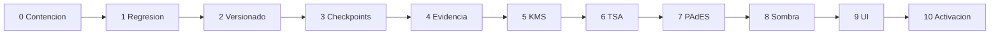

# Plan de migracion

Todas las etapas requieren aprobacion y se entregaran como paquetes pequenos, reversibles y verificables. No se modificaran los flujos actuales de firma antes de contar con regresion automatizada.

## Reglas de ejecucion

- Migraciones `ADD COLUMN`/`CREATE TABLE`; no renombrar ni eliminar campos historicos.
- Feature flags por tenant y entorno.
- Modo sombra antes de producir artefactos oficiales.
- Backfill por lotes con metricas y posibilidad de detenerse.
- Rollback funcional mediante flags; los registros legales nunca se borran.
- Cada paquete incluye prueba, observabilidad y criterio de salida.

## Paquete 0 - Contencion y linea base

Objetivo: asegurar el remoto antes de habilitar el motor.

- Aplicar y verificar cierre de politicas anonimas de identidad.
- Desplegar las migraciones pendientes en un entorno de staging.
- Confirmar buckets privados y RLS.
- Capturar inventario real de tablas, policies, funciones y versiones.
- Prohibir textos PAdES/TSA cuando `crypto_signature_applied = false` mediante feature flag, sin cambiar aun el resultado de firma.

Criterio de salida: cero lecturas anonimas no autorizadas y esquema staging reproducible.

## Paquete 1 - Contratos y pruebas de regresion

Sin cambios funcionales:

- Definir interfaces `KeyManagementProvider`, `TimestampProvider`, `PadesProvider`, `CryptoVerifier`.
- Crear fixtures PDF/certificados/timestamps de prueba.
- Congelar contratos actuales de `seal-pdf`, `sign-pdf-vps`, e.firma y NOM-151.
- Agregar pruebas de regresion de firmas actuales.

Rollback: eliminar solo codigo no conectado y tests.

## Paquete 2 - Versionado inmutable

Migracion no destructiva:

- Crear `document_versions` universal porque no existe equivalente para `documentos`.
- Agregar `document_version_id` y procedencia Storage a `document_certifications`.
- Backfill de documentos completados con hash conocido.
- Agregar constraints diferibles/validables en dos pasos.
- Implementar bloqueo de nuevas mutaciones sobre versiones congeladas.

Compatibilidad: `documentos` sigue siendo la entidad de negocio y referencia su version vigente.

## Paquete 3 - Checkpoints transaccionales

- Agregar `attempt_count`, `lease_owner`, `lease_expires_at`, `failed_at`, `failure_detail` sanitizado.
- Crear RPCs atomicos de claim, transition, fail y complete.
- Crear outbox de trabajos si no existe una cola durable reutilizable.
- Mantener `certification_state_transitions` como historial inmutable.
- Agregar indices parciales por estado/lease.

Criterio de salida: solicitudes concurrentes producen una sola certificacion y los reintentos reanudan sin duplicar.

## Paquete 4 - Ledger y normalizadores

- Desplegar `legal_evidence_events` y su RPC append-only.
- Backfill por referencia desde `document_audit_trail`, `document_integrity_log` y `document_activity_log` sin copiar PII innecesaria.
- Implementar normalizadores de `signature_evidence`, `document_evidence` y NOM-151.
- Verificar continuidad y conteos antes de activar certificacion.

Rollback: detener consumidores nuevos; conservar ledger generado.

## Paquete 5 - Configuracion de proveedores

- Crear `crypto_provider_configurations` con RLS tenant/admin.
- Guardar solo `secret_reference`, nunca el secreto.
- Health checks backend y estados de certificado.
- Implementar OpenBao Transit en desarrollo con RSA-3072.
- Eliminar dependencia de service-role dentro del proceso firmador.

Criterio de salida: firma/verify de digest con attestation y aislamiento tenant.

## Paquete 6 - TSA RFC 3161

- Implementar generador TSQ y parser/verificador TSR independiente.
- Persistir request, response, token y reporte.
- Validar EKU `timeStamping`, policy OID, nonce, cadena y vigencia.
- Probar indisponibilidad, token alterado y certificado expirado.

Criterio de salida: timestamp real validado sin confiar en banderas del proveedor.

## Paquete 7 - PAdES remoto

- Adaptar pyHanko para firma remota; retirar `SimpleSigner` con PEM en produccion.
- Preparar ByteRange/CMS y solicitar firma al proveedor de llaves.
- Incrustar cadena y timestamp.
- Verificar el PDF con un componente independiente.
- Mantener `sign-pdf-vps` detras de un flag de compatibilidad.

Criterio de salida: PAdES-B-T verificable con fixtures positivos y negativos.

## Paquete 8 - CertificationOrchestrator en sombra

- Extraer `createCertification()` detras de `CertificationOrchestrator`.
- Ejecutar en modo sombra para documentos de prueba.
- Comparar hashes, evidencia, tiempos y resultados con el flujo actual.
- No publicar artefactos ni cambiar estados de documentos reales.

## Paquete 9 - UI y operacion

- Extender la tarjeta existente.
- Agregar prueba integral de infraestructura.
- Descargar reporte tecnico de salud.
- Mostrar advertencias de desarrollo/software.
- Agregar dashboards, alertas y runbooks.

## Paquete 10 - Activacion gradual

1. Tenant interno de desarrollo.
2. Staging con certificados internos.
3. Produccion en modo lectura/verificacion.
4. Produccion para un tenant piloto.
5. Ampliacion progresiva con rollback por feature flag.

## Archivos previstos por paquete

| Paquete | Archivos existentes a modificar | Archivos nuevos probables |
|---|---|---|
| 1 | `src/lib/certification/adapters.ts`, pruebas | interfaces de proveedor |
| 2 | migraciones, repositorio documentos | migracion `document_versions` |
| 3 | `engine.ts`, migracion certificacion | RPCs/checkpoint repository |
| 4 | migraciones audit/evidence | normalizadores |
| 5 | `adapters.ts`, configuracion UI | adaptador OpenBao y migracion config |
| 6 | `adapters.ts` | verificador RFC 3161 |
| 7 | `vps/signer/*`, `sign-pdf-vps` | adaptador PAdES remoto |
| 8 | `engine.ts`, API certificaciones | `CertificationOrchestrator` |
| 9 | `visor-documento/[id]/page.tsx` | endpoint health/report |

## Dependencias estrictamente necesarias

No se instalara ninguna hasta aprobar arquitectura y proveedor.

- **PAdES:** conservar `pyHanko`/`pyhanko-certvalidator` si el firmador sigue en Python.
- **OpenBao:** cliente HTTP estandar es suficiente inicialmente; no requiere SDK obligatorio.
- **RFC 3161 en Node:** elegir una biblioteca ASN.1 mantenida o delegar parsing a Python/pyHanko; la decision requiere un spike aislado.
- **Cola:** preferir PostgreSQL/outbox o una capacidad ya disponible antes de incorporar un servicio nuevo.

## Estado de implementacion en Supabase

Aplicado al proyecto `kbjejiclhgjmiasauxyr` el 8 de agosto de 2026, en paquetes independientes:

1. `20260808115900_emergency_public_policy_lockdown.sql`
2. `20260805010000_cryptographic_certification_engine.sql`
3. `20260808120000_security_integrity_hardening.sql`

Verificaciones posteriores:

- Las siete tablas base de certificacion existen y tienen RLS habilitado.
- `legal_evidence_events` y `signature_otp_challenges` existen y tienen RLS habilitado.
- Los buckets `certification-artifacts`, `documents-signed` y `nom151-constancias` son privados.
- `avatars` permanece publico porque el perfil actual usa `getPublicUrl`; sus escrituras estan restringidas al propietario autenticado.
- Las tablas sensibles devuelven cero registros con la clave anonima.
- Los registros historicos permanecen disponibles con `service_role`; la migracion normalizo 859 eventos en `legal_evidence_events`.

La base remota no contiene actualmente `supabase_migrations.schema_migrations`. Las migraciones se ejecutaron desde el SQL Editor y una futura adopcion de Supabase CLI debe reconciliar el historial antes de ejecutar `db push`.
