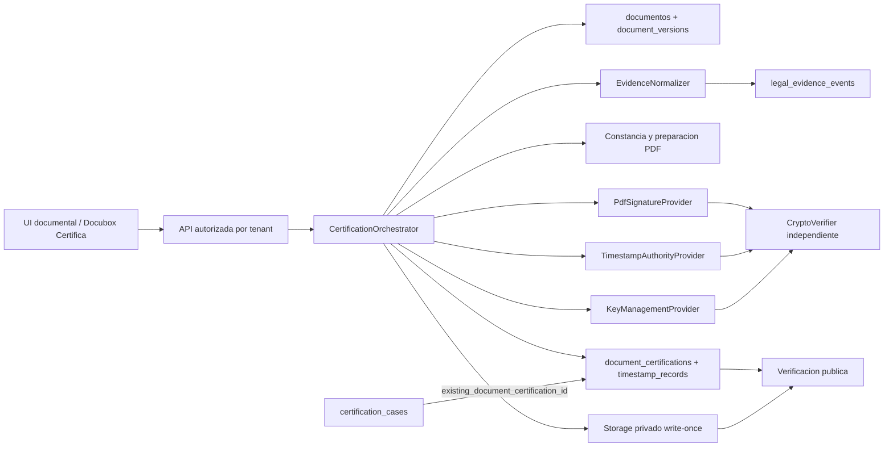
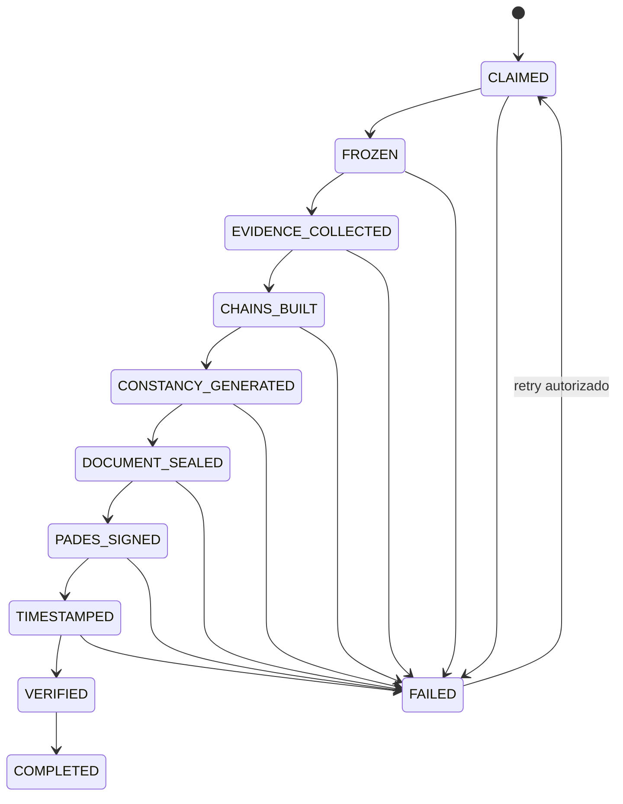

# Arquitectura objetivo

Fecha de corte: 2026-08-17

## Principios

- Un solo `CertificationOrchestrator` tecnico.
- `Docubox Certifica` consume el resultado tecnico; no lo simula.
- Version documental exacta, inmutable y enlazada por FK.
- Proveedores intercambiables, autenticados e idempotentes.
- Verificacion independiente del proveedor que firma o timestampa.
- Transacciones cortas en PostgreSQL y saga para efectos externos/Storage.
- Llaves no exportables; ningun secreto en frontend, tablas o artefactos.
- Fail-closed y estados de desarrollo diferenciados de produccion.

## Limites de dominio



## CertificationOrchestrator

Interfaz propuesta:

```ts
type CertificationCommand = {
  tenantId: string;
  documentId: string;
  documentVersionId: string;
  environment: 'development' | 'staging' | 'production';
  idempotencyKey: string;
  requestedBy: string;
  correlationId: string;
};

interface CertificationOrchestrator {
  start(command: CertificationCommand): Promise<{ certificationId: string; status: string }>;
  resume(certificationId: string): Promise<{ status: string }>;
  verify(certificationId: string): Promise<VerificationReport>;
}
```

Etapas durables:

1. `CLAIMED`: reclama version e idempotencia.
2. `FROZEN`: congela version y registra Storage ETag/version/hash.
3. `EVIDENCE_COLLECTED`: normaliza y sella snapshot de evidencia.
4. `CHAINS_BUILT`: genera cadenas y hashes canonicos.
5. `CONSTANCY_GENERATED`: crea PDF tecnico sin afirmar resultados futuros.
6. `DOCUMENT_SEALED`: obtiene sellos institucionales.
7. `PADES_SIGNED`: produce PDF PAdES.
8. `TIMESTAMPED`: incorpora RFC 3161 segun el perfil acordado.
9. `VERIFIED`: verificador independiente emite reporte.
10. `COMPLETED`: commit atomico de rutas, hashes, reporte y estado.

## Saga e idempotencia



Cada etapa debe tener `attempt_id`, `expected_previous_status`, `lease_owner`, `lease_expires_at` y salida hasheada. Las llamadas externas usan la misma `idempotency_key` por operacion. Los archivos se escriben en staging por intento; el commit final promueve referencias, no sobrescribe objetos.

## Proveedores

```ts
interface KeyManagementProvider {
  health(): Promise<ProviderHealth>;
  signDigest(input: SignDigestInput): Promise<KmsSignature>;
  getPublicMaterial(keyRef: string): Promise<PublicKeyMaterial>;
}

interface TimestampAuthorityProvider {
  timestamp(input: TimestampRequest): Promise<TimestampArtifacts>;
}

interface PdfSignatureProvider {
  sign(input: PadesRequest): Promise<Uint8Array>;
}

interface CryptoVerifier {
  verifyKmsSeal(input: KmsVerificationInput): Promise<ComponentResult>;
  verifyTimestamp(input: TimestampVerificationInput): Promise<ComponentResult>;
  verifyPades(input: Uint8Array, policy: TrustPolicy): Promise<PadesResult>;
}
```

`CryptoVerifier` no acepta booleanos de validacion del proveedor como prueba. Debe analizar bytes, certificados y politica de confianza local/configurada.

## Modelo de datos objetivo

### Extensiones no destructivas

`document_certifications`:

- `document_version_id uuid REFERENCES document_versions(id)`.
- `attempt_count`, `current_stage`, `lease_owner`, `lease_expires_at`, `failed_at`.
- `key_provider`, `key_id`, `key_version`, `pades_profile`.
- `tsa_provider`, `tsa_policy_oid`.
- rutas de certificado, cadena y reporte de verificacion.

`certification_cases`:

- `source_document_version_id uuid REFERENCES document_versions(id)`.
- Mantener `existing_document_certification_id` como enlace al resultado tecnico.

`document_versions`:

- conservar tabla y triggers;
- agregar identidad de objeto Storage (`bucket`, `object_version`, `etag`) si no cabe en metadata;
- separar permiso `versions.view` del entitlement comercial Colabora para usos juridicos.

### Tabla nueva justificada

`crypto_provider_configurations` porque no existe equivalente tecnico:

- tenant/workspace, tipo, nombre, entorno, enabled;
- `configuration_reference` y `secret_reference`;
- health, ultima prueba, vigencia de certificado y metadata no sensible.

`psc_providers` sigue siendo el catalogo comercial de PSC y no se reutiliza para secretos o politicas KMS.

## Custodia y confianza

### Desarrollo

- OpenBao Transit como primer adaptador recomendado.
- RSA-3072, llaves por proposito y entorno.
- AppRole/identidad de workload, ACL minima, audit device y rotacion.
- CA interna claramente marcada Development.

### Produccion

- KMS/HSM aprobado con llave no exportable.
- Certificado X.509 con politica, cadena, vigencia, EKU y revocacion definidos.
- Acceso privado/mTLS o workload identity.
- Separacion de funciones entre Docubox, KMS, TSA y verificador.

Una llave PEM o certificado autofirmado limita el estado UI a `Desarrollo operativo`.

## RFC 3161 y PAdES

El orden exacto de firma y timestamp debe quedar fijado por perfil PAdES y libreria. Para B-T, la estampa de firma debe estar contenida en la firma PDF y validarse junto con CMS/ByteRange. No basta anexar un token a metadata.

Verificacion minima:

- ByteRange y digest del PDF;
- CMS y algoritmo permitido;
- certificado firmante, cadena, vigencia, key usage/EKU;
- token RFC 3161, imprint, firma TSA, policy OID, nonce y EKU `timeStamping`;
- perfil PAdES alcanzado;
- hashes de cadenas, manifiesto y objetos Storage.

## Verificacion publica

El portal recibe solo un UUID/token aleatorio. El backend:

1. localiza la certificacion autorizada para publicacion;
2. descarga el PDF/artefactos exactos;
3. recalcula SHA-256;
4. ejecuta `CryptoVerifier` o lee un reporte firmado aun vigente;
5. muestra entorno, integridad, PAdES, certificado y timestamp;
6. nunca revela secretos, rutas internas ni PII no permitida.

Docubox Certifica puede presentar el resumen comercial y enlazar el reporte tecnico mediante `existing_document_certification_id`.

## Observabilidad

- `correlation_id` y `attempt_id` en logs, proveedor y Storage.
- Metricas por etapa, tenant, entorno y codigo de fallo.
- Health checks persistidos sin secretos.
- Alertas de certificado proximo a vencer, TSA/KMS degradado y reintentos agotados.
- Auditoria de iniciar, reintentar, verificar, descargar y revocar.

## Estados de interfaz

`No configurado`, `Parcialmente configurado`, `Configuracion invalida`, `Desarrollo operativo`, `Produccion operativa`, `Degradado`, `Certificado proximo a vencer` y `Error de verificacion`.

La tarjeta existente **Integridad y Evidencia Digital** es el punto de configuracion; no se crea otra pantalla paralela.
