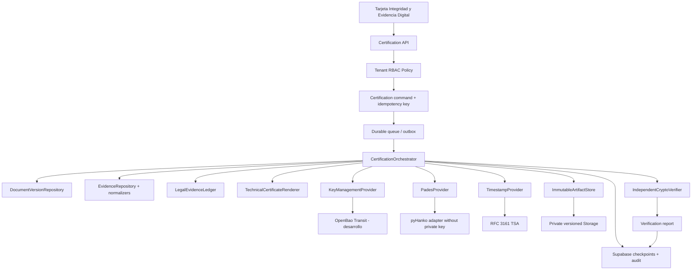
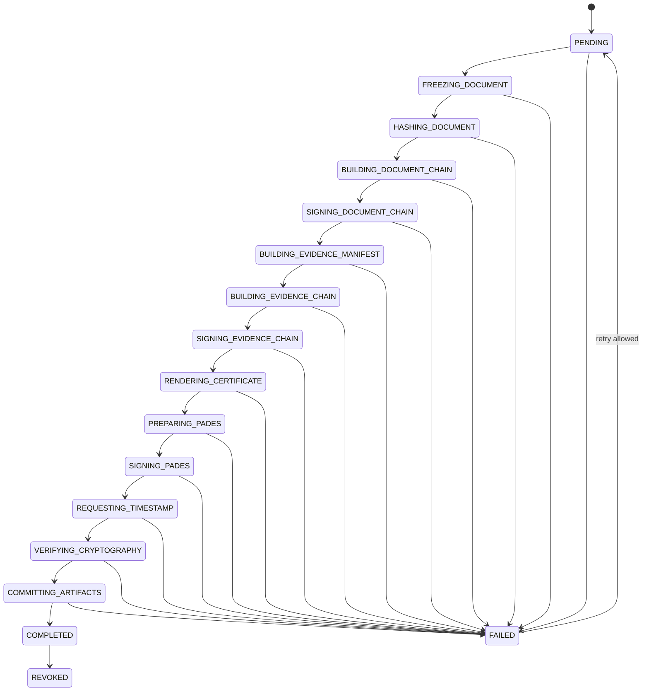
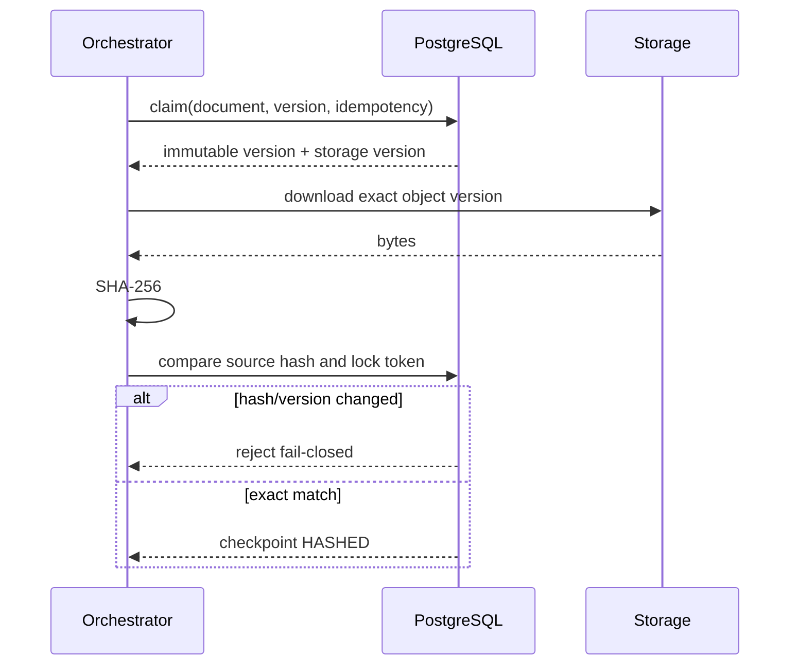

# Arquitectura objetivo

## Principios

- Un solo `CertificationOrchestrator` gobierna la certificacion.
- Las firmas actuales de participantes permanecen sin cambios durante la adopcion.
- El documento se certifica por una version inmutable, nunca por una URL mutable.
- Toda operacion externa es idempotente y verificable de forma independiente.
- El motor falla cerrado: ninguna ausencia de KMS, TSA o PAdES produce un estado valido.
- Las llaves privadas viven exclusivamente en el proveedor de llaves.
- Los secretos solo se resuelven en backend desde un administrador de secretos.
- Supabase conserva referencias, metadatos publicos y evidencia; no llaves privadas.

## Componentes



## Contrato del orquestador

```ts
interface CertificationCommand {
  tenantId: string;
  documentId: string;
  documentVersionId: string;
  environment: 'development' | 'staging' | 'production';
  idempotencyKey: string;
  requestedBy: string;
  correlationId: string;
}

interface CertificationOrchestrator {
  execute(command: CertificationCommand): Promise<CertificationResult>;
  resume(certificationId: string): Promise<CertificationResult>;
}
```

El endpoint actual `POST /api/documents/:documentId/certifications` debe conservarse como fachada de compatibilidad. Internamente resolvera la version definitiva y encolara el comando.

## Maquina de estados



Cada transicion debe realizarse mediante una funcion SQL que, en una sola transaccion:

1. valide estado esperado y lease;
2. compruebe tenant/document/version;
3. actualice checkpoint;
4. inserte la transicion;
5. agregue evento al ledger;
6. inserte trabajo siguiente en outbox.

## Version definitiva y bloqueo



Las rutas de edicion deben rechazar cambios cuando la version tenga `frozen_at` o cuando el documento este `certification_locked`. El bloqueo se libera solo si el intento falla antes de emitir evidencia irreversible; una version certificada nunca se descongela.

## Proveedores

### KeyManagementProvider

Responsabilidades:

- firmar digest con una llave no exportable;
- devolver identificador/version, clave publica, certificado y attestation;
- verificar la firma antes de responder;
- aplicar politicas por tenant, entorno y proposito.

Primera implementacion recomendada: OpenBao Transit en desarrollo. El adaptador PKCS#11 queda para una fase posterior.

### PadesProvider

- prepara `ByteRange` y CMS mediante una libreria especializada;
- solicita firma al KMS, sin leer llave privada;
- incorpora cadena X.509 y token RFC 3161;
- produce PAdES-B-T;
- devuelve PDF y reporte tecnico.

El codigo pyHanko actual puede reutilizarse, pero `cert_loader.py` debe reemplazarse por un firmador remoto.

### TimestampProvider

- construye y conserva TSQ;
- solicita TSR a la TSA;
- valida message imprint, nonce, policy, firma, EKU y cadena;
- devuelve token y reporte estructurado.

### IndependentCryptoVerifier

Debe ejecutarse despues del proveedor y no confiar en sus banderas. Verifica:

- hash del PDF y ByteRange;
- CMS y certificado firmante;
- cadena, vigencia, EKU y politica de confianza;
- token RFC 3161 y su cadena;
- hashes de cadenas, manifiesto y ledger;
- entorno y tipo de proteccion.

## Persistencia

- `document_certifications`: registro agregado y estado.
- `document_versions` futuro: snapshot universal inmutable.
- `evidence_manifests` e items: inventario canonico.
- `timestamp_records`: evidencia RFC 3161.
- `cryptographic_keys`: solo material publico y attestation.
- `crypto_provider_configurations` futuro: referencias de configuracion/secretos.
- `certification_state_transitions`: historial inmutable.
- `certification_access_logs`: accesos y verificaciones.
- `legal_evidence_events`: ledger canonico.

## Idempotencia y recuperacion

- La clave es unica por `tenant_id + idempotency_key`.
- Cada llamada a proveedor usa una clave derivada: `certification_id:attempt_id:step`.
- Los artefactos se escriben primero bajo `staging/<attempt_id>/`.
- El commit final copia/promueve referencias de forma inmutable; nunca sobrescribe.
- Un reconciliador elimina staging abandonado despues de retencion.
- Los errores se clasifican como `RETRYABLE`, `TERMINAL` o `MANUAL_REVIEW`.
- Reanudar lee el ultimo checkpoint valido, recalcula hashes y continua.

## Interfaz objetivo

La tarjeta existente en `src/app/visor-documento/[id]/page.tsx:4929` mostrara:

- entorno y estado general;
- proveedor de llaves y proteccion `software`, `transit` o `HSM`;
- certificado, fingerprint y vigencia;
- motor/perfil PAdES;
- TSA y policy OID;
- ultima prueba integral;
- incidencias accionables;
- ejecutar prueba;
- descargar reporte tecnico.

Estados de UI:

- No configurado
- Parcialmente configurado
- Configuracion invalida
- Desarrollo operativo
- Produccion operativa
- Degradado
- Certificado proximo a vencer
- Error de verificacion

La UI deriva estos estados del reporte de salud backend. Nunca infiere validez solo por presencia de variables.

