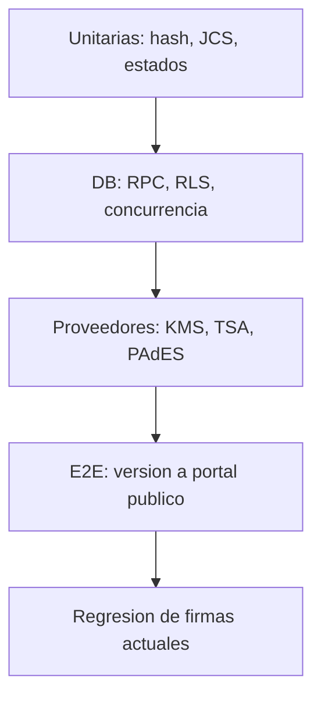

# Plan de pruebas

Fecha de corte: 2026-08-17

## Estrategia

Ninguna prueba usa llaves productivas. Los fixtures criptograficos de desarrollo deben ser reproducibles y estar claramente marcados.

## Fixtures

- PDF minimo, multipagina, formulario, corrupto y con un byte alterado.
- Versiones original, editable, congelada, firmada y certificada.
- CA raiz/intermedia de desarrollo.
- Certificados valido, expirado, aun no valido, no confiable, revocado y proximo a vencer.
- Certificado TSA valido y sin EKU `timeStamping`.
- TSQ/TSR valido y mutaciones de imprint, nonce, policy y firma.
- CMS/PAdES valido y mutaciones de ByteRange, Contents y certificado.
- Dos tenants con owner, admin, certificador, participante y usuario ajeno.
- Fallos deterministas de KMS, TSA, PAdES, Storage y DB.

## Casos obligatorios

| ID | Caso | Nivel | Resultado esperado |
|---|---|---|---|
| T01 | SHA-256 conocido | Unitario | Coincide con vector |
| T02 | Cambio de un byte | Unitario/E2E | Hash distinto y rechazo |
| T03 | Canonicalizacion RFC 8785 | Unitario | Vectores oficiales pasan |
| T04 | Misma canonica en Node/proveedor | Integracion | Bytes y hash identicos |
| T05 | Version exacta certificada | DB/E2E | FK, hash y Storage coinciden |
| T06 | Cambio durante certificacion | Integracion | Commit rechazado |
| T07 | Firma RSA-PSS valida | Criptografico | Verificador independiente valida |
| T08 | Firma alterada | Criptografico | Falla cerrado |
| T09 | Certificado expirado/no confiable | Criptografico | No completa produccion |
| T10 | Certificado proximo a vencer | Health/UI | Estado degradado/advertencia |
| T11 | RFC 3161 valido | Criptografico | Imprint, firma, EKU, policy y cadena validos |
| T12 | RFC 3161 alterado | Criptografico | Rechazo por componente exacto |
| T13 | TSA no disponible | Integracion | Fallo reintentable, checkpoint preservado |
| T14 | PAdES B-T valido | Criptografico | ByteRange, CMS, cadena y timestamp validos |
| T15 | PAdES alterado | Criptografico | Rechazo aunque gateway diga VALID |
| T16 | KMS no disponible | Integracion | Sin sello simulado ni estado completo |
| T17 | Reintento idempotente | Integracion | Mismo resultado, sin duplicados |
| T18 | Duplicado concurrente | DB | Un claim y respuesta estable |
| T19 | Evento concurrente Certifica | DB | Secuencias unicas, cadena continua |
| T20 | Fallo despues de upload | Integracion | Reconciliacion/reanudacion sin colision |
| T21 | Acceso entre tenants | Seguridad | 403/404, cero metadata |
| T22 | Usuario sin permiso | Seguridad | No ejecuta, reintenta, descarga ni configura |
| T23 | PDF corrupto | Integracion | Falla antes de KMS |
| T24 | Verificacion publica E2E | E2E | Re-hash y verificacion completa |

## Contratos de proveedores

### KMS

- Token/workload identity ausente o incorrecta.
- Algoritmo degradado, RSA menor a 3072 y key version inesperada.
- Firma de digest frente a firma de mensaje: vectores interoperables obligatorios.
- Attestation ausente, llave revocada y respuesta duplicada.

### TSA

- Response malformada, serial repetido, nonce distinto y policy no permitida.
- Certificado TSA sin EKU, expirado o no confiable.
- Gateway reporta valido con token alterado: el verificador debe rechazar.

### PAdES

- ByteRange fuera de limites, digest distinto y firma CMS corrupta.
- Certificado distinto al key id esperado.
- Perfil declarado B-T que realmente solo alcanza B-B.
- Cambios incrementales permitidos y no permitidos posteriores a la firma.

## Seguridad Supabase

- RLS `SELECT/INSERT/UPDATE/DELETE` para todas las tablas tecnicas y Certifica.
- `document_versions` accesible a certificador autorizado sin depender de Colabora y negada a otro tenant.
- `SECURITY DEFINER` sin EXECUTE publico salvo wrappers justificados.
- Funciones criticas con `search_path` fijo.
- Storage: path de otro tenant, traversal, bucket equivocado y overwrite de artefacto cerrado.
- Edge Functions: sin token, JWT invalido, usuario sin acceso y token interno incorrecto.
- Politica publica de `cryptographic_keys` no expone metadata sensible.

## e.firma y secretos

- `.key` y password nunca aparecen en logs, errores, DB, Storage ni trazas.
- Gateway recibe datos solo sobre canal autenticado.
- Timeout/cancelacion no persiste buffers temporales.
- Error del proveedor se sanitiza antes de frontend.

## Regresion obligatoria

Antes de modificar el comportamiento actual:

1. Firma autografa digital y evidencias.
2. Click & Sign/OTP.
3. e.firma SAT valida, password incorrecta y archivos corruptos.
4. Orden secuencial/paralelo y participantes.
5. Descarga original, firmado y constancia.
6. NOM-151 existente.
7. Visor y ambos portales publicos.
8. `seal-pdf` y `sign-pdf-vps` tras feature flags separados.
9. Caso Certifica sandbox permanece `NO VALIDO / DEMOSTRACION`.

## Recuperacion

Inyectar una caida despues de cada etapa: freeze, evidencia, cadena, KMS, constancia, PAdES, TSA, verificacion, upload y commit. Al reanudar:

- no repetir efectos externos ya confirmados;
- no crear otro folio/certificacion;
- conservar auditoria continua;
- no sobrescribir artefactos;
- cerrar solo si todos los hashes/rutas/reporte coinciden.

## Criterio de aprobacion

- T01-T24 pasan en CI y staging.
- Cero riesgos criticos abiertos.
- Cero cruce de tenant en DB, API y Storage.
- Verificador independiente acepta el PDF valido y rechaza todas las mutaciones.
- Regresion actual sin cambios observables.
- Advisor Supabase sin hallazgos relevantes nuevos.
- La UI distingue desarrollo, degradado y produccion.
