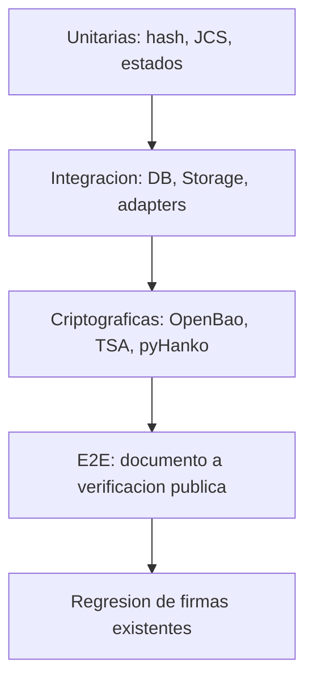

# Plan de pruebas

## Estrategia

La piramide combina pruebas unitarias deterministas, integracion con proveedores simulados, integracion criptografica real en desarrollo y E2E contra Supabase aislado. Ninguna prueba usa llaves o certificados productivos.

## Fixtures

- PDF minimo valido de una pagina.
- PDF multipagina con formulario y firmas visuales.
- PDF corrupto y PDF con un byte alterado.
- CA raiz/intermedia de desarrollo.
- Certificado valido, expirado, aun no valido, no confiable y proximo a vencer.
- Certificado TSA con y sin EKU `timeStamping`.
- TSR valido y tokens con imprint, firma, nonce y policy alterados.
- Respuestas KMS RSA-PSS validas e invalidas.
- Dos tenants, propietarios, administradores, participantes y usuario externo.

## Casos obligatorios

| ID | Caso | Nivel | Resultado esperado |
|---|---|---|---|
| T01 | Hash correcto | Unitario | Coincide con vector SHA-256 conocido |
| T02 | Cambio de un byte | Unitario/E2E | Cambia hash y verificacion falla |
| T03 | Firma valida | Criptografico | CMS, ByteRange y cadena validos |
| T04 | Firma alterada | Criptografico | `PADES_SIGNATURE_INVALID` |
| T05 | Certificado expirado | Criptografico | Falla cerrado, sin `COMPLETED` |
| T06 | Certificado no confiable | Criptografico | Estado no confiable; produccion rechazada |
| T07 | Timestamp valido | Criptografico | Imprint, firma, EKU, policy y cadena validos |
| T08 | Timestamp alterado | Criptografico | `RFC3161_VALIDATION_FAILED` |
| T09 | TSA no disponible | Integracion | Error reintentable; checkpoint preservado |
| T10 | KMS no disponible | Integracion | Error reintentable; sin sello simulado |
| T11 | Reintento idempotente | Integracion | Misma certificacion/artefactos, sin duplicados |
| T12 | Solicitud duplicada concurrente | Integracion | Un solo claim gana; otra obtiene resultado existente |
| T13 | Documento cambia durante certificacion | Integracion | Precondicion de version/hash rechaza commit |
| T14 | Acceso entre tenants | Seguridad | 404/403 y cero filtracion de metadatos |
| T15 | Usuario sin permiso | Seguridad | No puede ejecutar, reintentar ni descargar |
| T16 | PDF corrupto | Unitario/Integracion | Falla antes de KMS y registra codigo sanitizado |
| T17 | Certificado proximo a vencer | Health/UI | Estado `CERTIFICATE_EXPIRING`, no produccion sana |
| T18 | Fallo parcial | Integracion | Artefactos en staging, estado consistente |
| T19 | Recuperacion posterior | Integracion | Reanuda desde checkpoint sin repetir efectos |
| T20 | Verificacion E2E | E2E | Documento, cadenas, sellos, TSA, PAdES y root validos |

## Pruebas adicionales de seguridad

- RLS `SELECT/INSERT/UPDATE/DELETE` para cada tabla de certificacion.
- Storage por tenant, documento y path malformado.
- Idempotency key reutilizada con otro documento.
- Manipulacion de `tenant_id` en payload.
- Token de gateway ausente, incorrecto y expirado.
- Respuesta de proveedor con algoritmo degradado o RSA menor a 3072.
- Certificado distinto al esperado por key id/version.
- Error del proveedor con secreto en detalle: el frontend debe recibir codigo sanitizado.
- URL publica aleatoria no existente y certificacion revocada.
- Descarga privada por participante autorizado y usuario ajeno.
- Intento de sobrescribir PDF certificado.
- Intento de modificar/borrar transiciones y ledger.

## Pruebas de compatibilidad

Antes de tocar firmas actuales:

1. Firma autografa completa y evidencia persistida.
2. e.firma SAT valida, invalida y archivo corrupto.
3. Click & Sign con OTP.
4. Orden secuencial y paralelo.
5. Descarga del documento actual.
6. NOM-151 actual.
7. Visor y portal de verificacion existentes.
8. `seal-pdf` y `sign-pdf-vps` bajo feature flags separados.

## Pruebas de estados y transacciones

- Cada transicion acepta solo el estado anterior esperado.
- Estado y evento se escriben en una sola transaccion.
- Lease expirado puede ser reclamado; lease vigente no.
- `COMPLETED` requiere todas las rutas/hashes/reporte.
- `FAILED` conserva codigo, etapa, intento y detalle sanitizado.
- La caida despues de KMS, TSA, upload o DB commit se recupera sin duplicar.

## Herramientas y ubicacion propuesta

- Mantener `node:test` para canonicalizacion y utilidades puras.
- Pruebas TypeScript junto a `src/lib/certification`.
- Pruebas Python junto a `vps/signer` para pyHanko/verificacion.
- Entorno Supabase local o proyecto staging desechable para RLS/Storage.
- No depender del remoto productivo para CI.

## Criterio de aprobacion

- 100% de los casos T01-T20 pasan.
- Cero hallazgos criticos abiertos.
- Pruebas de acceso entre tenants pasan en tablas, APIs y Storage.
- El verificador independiente valida un PDF generado y rechaza todas las mutaciones.
- Regresion de firmas actuales sin cambios observables.
- Reporte de salud distingue desarrollo de produccion.

