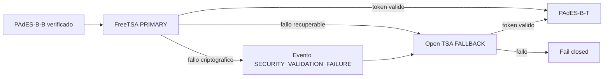

# WP-EXTERNAL-FREE-TSA-PRODUCTION - Resultado

## Estado

**PASS - REAL EXTERNAL FREETSA PADES-B-T VERIFIED**

**PASS - REAL EXTERNAL TSA FALLBACK VERIFIED**

La implementacion reutiliza el PAdES-B-B, PAdES-B-T, KMS, X.509, CMS, verificacion y persistencia existentes. FreeTSA opera como proveedor primario y Open TSA como respaldo. No se reconstruyo el motor ni se volvio a firmar con KMS para incorporar el `SignatureTimeStamp`.

Este resultado acredita operacion tecnica RFC 3161 externa. No acredita NOM-151, PSC mexicano, sello cualificado eIDAS ni SLA comercial.

## 1. Archivos reutilizados

- `src/lib/certification/timestamp.ts`: solicitud, parseo y validacion RFC 3161.
- `src/lib/certification/pades.ts`: promocion PAdES-B-B a PAdES-B-T.
- `src/lib/certification/key-management.ts`: proveedor KMS existente.
- `src/lib/certification/certificates.ts`: certificado X.509 existente.
- `src/lib/certification/product-integration.ts`: integracion con documentos reales.
- `src/lib/certification/engine.ts`: orquestacion y persistencia existente.
- `document_certifications`, `document_pdf_signatures` y `timestamp_records`.
- Storage privado y versionado de artefactos existente.

## 2. Archivos creados o modificados

- `src/lib/certification/external-timestamp.ts`
- `src/lib/certification/timestamp.ts`
- `src/lib/certification/providers.ts`
- `src/lib/certification/product-integration.ts`
- `src/lib/certification/engine.ts`
- `src/lib/certification/types.ts`
- `src/app/visor-documento/[id]/page.tsx`
- `scripts/onboard-external-tsa-trust.ts`
- `scripts/test-external-tsa.ts`
- `tests/external-timestamp-router.test.mjs`
- `infra/tsa/trust-bundles/freetsa/v1/*`
- `infra/tsa/trust-bundles/open-tsa/v1/*`
- `supabase/migrations/20260829005923_external_tsa_provenance.sql`
- `.env.example` y `package.json`

## 3. Onboarding FreeTSA

Se usaron solamente fuentes oficiales:

- endpoint RFC 3161: `https://freetsa.org/tsr`
- certificado TSA: `https://freetsa.org/files/tsa.crt`
- CA: `https://freetsa.org/files/cacert.pem`

La solicitud usa SHA-256, nonce criptograficamente seguro, `Content-Type: application/timestamp-query` y exige `application/timestamp-reply`. No se configura ni inventa una policy OID; se valida y persiste la devuelta legitimamente por la TSA.

## 4. Fingerprints verificados

Artefactos oficiales FreeTSA:

- SHA-256 del archivo TSA: `8bfb0305bb64e2571ca507552ef3245cb1c2fee8728e0ff8689225081ea13467`
- SHA-256 del archivo CA: `2151b61137ffa86bf664691ba67e7da0b19f98c758e3d228d5d8ebf27e044438`
- fingerprint DER del certificado TSA: `32e841a95cc1164101ffde41298ef2fc75c1c4372ef095e88a6bbd47dfb191fc`
- fingerprint DER de la raiz: `a6379e7cecc05faa3cbf076013d745e327bbbaa38c0b9af22469d4701d18aabc`

## 5. Onboarding Open TSA

Se usaron las fuentes oficiales del proyecto:

- endpoint RFC 3161: `https://tsr.open-tsa.eu`
- Root CA: `https://open-tsa.eu/certs/ca.crt`
- cadena completa: `https://open-tsa.eu/certs/fullchain.pem`

El certificado TSA leaf se obtuvo mediante una solicitud controlada y se valido contra la cadena oficial. Fingerprints DER:

- certificado TSA: `cda5253f30385ce0f7067d2fb51a1726c3db5f73a02a0eede24ce868cd9497d4`
- raiz: `e45a75cb526087638107d4a3e9535b51145efddf88c5cabea9b09e0ab439af95`

## 6. Trust bundles

Los bundles son independientes y versionados:

- `freetsa-v1`: PRIMARY, prioridad 1.
- `open-tsa-v1`: FALLBACK, prioridad 2.

Cada manifiesto conserva fuentes, hashes de archivos, fingerprints de certificados, vigencias, estado e instalacion. La certificacion persistida referencia el bundle usado. Un nuevo trust anchor requiere onboarding controlado; nunca se descarga silenciosamente durante una firma.

Vigencias observadas durante el onboarding:

- FreeTSA leaf: 2026-02-15 a 2040-02-02.
- FreeTSA root: 2016-03-13 a 2041-03-07.
- Open TSA leaf: 2026-04-04 a 2028-04-03.
- Open TSA root: 2026-04-04 a 2051-03-29.

## 7. Provider router

`TimeStampProviderRouter` resuelve `TSA_POLICY=external-free` como:

El fallback conserva la causa primaria, su clasificacion y el rol del proveedor que finalmente emitio el token.

## 8. Retry policy

- Un intento primario y un reintento corto con jitter.
- Fallback solamente despues de clasificar el fallo.
- Se respeta `Retry-After` en segundos o fecha HTTP, con espera acotada.
- No se realizan solicitudes paralelas duplicadas.
- Respuestas vacias, MIME incorrecto y RFC 3161 rechazado se clasifican explicitamente.

## 9. Circuit breaker

El estado se mantiene por proveedor. Cinco fallos temporales consecutivos abren el circuito; durante la ventana se usa el fallback. Un probe half-open permite recuperar el primario sin convertir un timeout aislado en un cambio permanente.

## 10. Rate limiting

El router aplica control por proveedor y backpressure local, clasifica HTTP 429 y respeta `Retry-After`. Open TSA se configura considerando su limite documentado de 60 solicitudes por minuto por IP. No se asume capacidad ilimitada.

## 11. Health checks

Los controles son independientes por proveedor y verifican configuracion, bundle cargado, vigencia y disponibilidad HTTP sin consumir continuamente timestamps. Los estados son `HEALTHY`, `DEGRADED`, `UNAVAILABLE` y `SECURITY_FAILURE`. La prueba RFC 3161 real queda reservada para monitoreo sintetico controlado.

## 12. Validacion RFC 3161

La validacion fail-closed comprueba:

- `PKIStatus`, DER y CMS parseables;
- `messageImprint` y SHA-256;
- nonce exacto;
- policy OID ASN.1 valida y coincidencia cuando se configura;
- serial y `genTime`;
- firma del token;
- EKU `timeStamping`;
- vigencia del certificado en `genTime`;
- cadena y trust root del bundle;
- consistencia ASN.1 y huella del token.

Un HTTP 200 nunca se interpreta por si solo como timestamp valido.

## 13. FreeTSA E2E

Documento real Docubox: `0fb45788-8a8f-4799-85b1-d097aad6db4a`.

PDF: `output/pdf/docubox-real-0fb45788-8a8f-4799-85b1-d097aad6db4a-freetsa-pades-bt.pdf`.

Resultados:

- conectividad FreeTSA: PASS
- TimeStampReq RFC 3161: PASS
- token: PASS
- imprint SHA-256: PASS
- nonce: PASS
- policy devuelta `1.2.3.4.1`: PASS
- certificado TSA: PASS
- cadena y raiz: PASS
- PAdES-B-T: PASS
- persistencia y Storage: PASS

**REAL EXTERNAL FREETSA PADES-B-T VERIFIED**

## 14. Fallback Open TSA E2E

Documento real Docubox: `0231221c-aa64-48d0-a90c-bfb52167c6f9`.

PDF: `output/pdf/docubox-real-0231221c-aa64-48d0-a90c-bfb52167c6f9-open-tsa-pades-bt.pdf`.

Se forzo de forma controlada una conexion primaria a `127.0.0.1:1`, sin alterar FreeTSA. El router conservo `TSA_HTTP_ERROR`, uso Open TSA y valido el token con su bundle independiente.

- policy devuelta: `1.3.6.1.4.1.59085.1.1`
- rol persistido: FALLBACK
- `fallback_used`: true
- PAdES-B-T: PASS

**REAL EXTERNAL TSA FALLBACK VERIFIED**

## 15. PAdES-B-T final

La promocion agrega el `SignatureTimeStamp` al CMS ya firmado. No vuelve a llamar a KMS ni cambia el `ByteRange` firmado. El PDF se promueve como definitivo solamente cuando pasan la verificacion PAdES interna e independiente.

## 16. OpenSSL

En ambos documentos reales pasaron:

- verificacion CMS con OpenSSL;
- verificacion RFC 3161 del `.tsr` contra su solicitud y bundle;
- validacion PAdES interna e independiente.

Modificar un byte produce el fallo esperado.

## 17. Persistencia

La migracion `20260829005923_external_tsa_provenance.sql` fue aplicada al proyecto Supabase `kbjejiclhgjmiasauxyr` y conserva:

- proveedor, rol y endpoint logico;
- policy, serial y `genTime`;
- subject, issuer, serial y fingerprint TSA;
- fingerprint raiz y cadena;
- trust bundle;
- algoritmo, imprint y hash del token;
- estado y fecha de verificacion;
- uso y causa del fallback;
- codigo y clase del fallo primario.

No se almacenan credenciales, tokens HTTP ni encabezados de autorizacion.

## 18. UI

El visor deriva el estado de evidencia persistida. Para usuario normal muestra `PAdES-B-T verificado`, sello RFC 3161 verificado y fecha/hora. La vista tecnica agrega proveedor, serial, `genTime`, policy, fingerprint, bundle y confianza. NOM-151 permanece separado y solo aparece cuando existe su constancia real.

## 19. Pruebas negativas

Se probaron 17 escenarios del router, incluidos timeout, 429, 500, respuesta vacia, respuesta no RFC 3161, token corrupto, imprint, nonce, certificado, raiz, policy, firma y cadena invalidos, circuit breaker, ambos proveedores caidos e idempotencia. Todos fallan de forma cerrada y los fallos criptograficos se clasifican como `SECURITY_VALIDATION_FAILURE`.

## 20. Regresion

- `npm run type-check`: PASS.
- `npm run build`: PASS (212 paginas generadas).
- suite completa Node: 89/89 PASS.
- pruebas enfocadas de TSA/router: 22/22 PASS.
- Google Cloud KMS real: PASS.
- PAdES-B-B KMS real: PASS.
- E2E externo FreeTSA/Open TSA: PASS.
- ESLint dirigido del paquete: 0 errores y 7 advertencias de tipos JSON preexistentes en adaptadores.
- El lint global fue interrumpido porque permanecio consumiendo CPU sin emitir resultado; la comprobacion dirigida y el build de produccion si finalizaron.

## 21. Riesgos operativos pendientes

- FreeTSA y Open TSA son servicios gratuitos sin SLA comercial garantizado.
- El leaf actual de Open TSA vence el 3 de abril de 2028; se debe incorporar un bundle posterior antes de esa fecha.
- La rotacion de root/CA requiere onboarding, revision y despliegue controlados.
- Debe programarse monitoreo sintetico con una frecuencia prudente y alertas externas para `SECURITY_VALIDATION_FAILURE`.
- La disponibilidad compartida por IP puede activar rate limits; la cola y el fallback reducen el riesgo, pero no sustituyen capacidad contratada.
- Los asesores de Supabase siguen reportando deuda historica no introducida por este WP, principalmente funciones `SECURITY DEFINER` con `search_path` mutable y tablas RLS sin politicas. Debe tratarse en un paquete de endurecimiento separado.
- Para garantias regulatorias mexicanas o disponibilidad contractual se requiere un proveedor PSC/TSA comercial; el contrato de proveedores permite sustituir estas TSA sin cambiar KMS, X.509, CMS, ByteRange ni el workflow.

## Fuera de alcance

No se implementaron NOM-151, PAdES-B-LT, PAdES-B-LTA, HSM ni migraciones de Google KMS/X.509. FreeTSA y Open TSA no se presentan como PSC mexicano ni como certificacion gubernamental.
