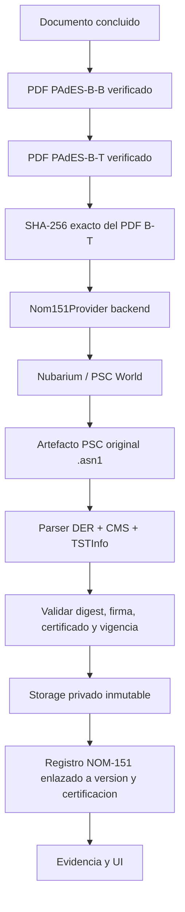

# WP-NOM151-AUDIT-ALIGNMENT - Resultado

## Estado

**IMPLEMENTADO - NOM151_PROVIDER_NOT_PRODUCTION**

Docubox emitio y verifico una constancia NOM-151 real con Nubarium/PSC World sobre el artefacto exacto PAdES-B-T previamente verificado. El resultado no se clasifica como produccion porque `NOM151_PROVIDER_ENVIRONMENT` permanece en `unknown` y no se ha configurado la raiz de confianza del PSC para validar la cadena completa de manera local. No se simulo `PASS` ni se infirio validez por texto, fecha de servidor o presencia visual.

## 1. Alcance y auditoria

Se audito la implementacion existente y se conservo el flujo real de Nubarium, la tabla `nom151_constancias_doc`, el bucket privado `nom151-constancias`, las vistas de descarga y el renderer PDF de Docubox. No se creo un segundo motor NOM-151 ni se mezclo este servicio con la TSA RFC 3161 usada por PAdES-B-T.

## 2. Arquitectura actual alineada

La TSA PAdES y el PSC NOM-151 son servicios separados, con artefactos, estados y proveedores distintos.

## 3. Componentes reutilizados

- Tabla `public.nom151_constancias_doc` y registros historicos.
- Bucket privado `nom151-constancias`.
- Integracion Nubarium existente y su protocolo de envio del PDF completo.
- `document_certifications` como fuente del PAdES-B-T verificado.
- Render visual de la constancia y descargas existentes.
- Autorizacion documental y pertenencia al workspace existentes.

## 4. Clasificacion del proveedor

- Proveedor tecnico: `nubarium-nom151`.
- PSC observado en el artefacto: `PSC World S.A. de C.V.`.
- Endpoint configurado: servicio NOM-151 de Nubarium.
- Entorno declarado: `unknown`.
- Clasificacion operativa: real pero **no acreditada como produccion por configuracion**.

Para declarar produccion se requiere configurar explicitamente `NOM151_PROVIDER_ENVIRONMENT=production` solo despues de confirmar contractualmente el entorno y cargar la raiz de confianza del PSC. La aplicacion nunca convierte `unknown` o `sandbox` en produccion por inferencia.

## 5. Fuente exacta PAdES-B-T

La emision solo acepta una fila actual de `document_certifications` que cumpla:

- `status = completed`;
- perfil `PAdES-B-T`;
- PDF, certificado, timestamp y verificacion en estado valido;
- `document_version_id` de la version final;
- `certified_pdf_path` existente en `certification-artifacts`.

El servicio descarga ese PDF, recalcula SHA-256 y registra el digest exacto que se envia al PSC. Una constancia historica emitida sobre otra revision no se muestra como constancia actual.

## 6. Abstraccion de proveedor

Se agrego `Nom151Provider` y `NubariumNom151Provider` en `src/lib/nom151/provider.ts` con:

- `healthCheck()`;
- `certify()`;
- `verifyArtifact()`.

Credenciales, autenticacion y llamadas HTTP permanecen exclusivamente del lado servidor. El orquestador de emision consume la interfaz y no conoce secretos del proveedor.

## 7. Solicitud y minimizacion

Nubarium requiere el PDF completo para emitir la constancia. Docubox envia exclusivamente el artefacto final PAdES-B-T y los campos tecnicos requeridos por el protocolo. No envia participantes, correos, CURP, RFC, llaves privadas, tokens de sesion ni metadatos ajenos a la operacion.

Se aplican timeout, reintentos controlados, `idempotency_key` y sanitizacion de errores. No se registran credenciales ni el PDF completo en logs.

## 8. Validacion de respuesta

La respuesta del proveedor debe tener:

- HTTP valido y JSON parseable;
- `estatus = OK`;
- codigo de validacion;
- hash SHA-256 coincidente;
- artefacto Base64 DER valido.

Un rechazo del PSC queda en `failed` con codigo y detalle sanitizados. No se persiste una constancia como emitida si falla cualquiera de estos controles.

## 9. Verificacion independiente del artefacto

El verificador local analiza el `TimeStampResp`/CMS/TSTInfo entregado como `.asn1` y comprueba:

- estructura DER;
- estado concedido por el PSC;
- policy OID;
- message imprint SHA-256;
- enlace con el digest del PDF PAdES-B-T;
- firma CMS;
- vigencia del certificado al momento de emision;
- serial, sujeto, emisor y fingerprint del certificado.

La cadena completa se reporta como `not_available` cuando la raiz de confianza no esta configurada; nunca se convierte ese estado en `true`.

## 10. Persistencia

La migracion `20260829023344_nom151_audit_alignment.sql` extiende la tabla existente sin destruir historico. Se guardan:

- `document_version_id` y `document_certification_id`;
- proveedor, PSC y entorno;
- operacion, folio e idempotencia;
- algoritmo y digest del documento;
- perfil y revision PAdES;
- ubicacion y tipo del artefacto fuente;
- formato y ruta del artefacto PSC;
- estado de emision y verificacion;
- metadata publica del certificado y verificacion.

## 11. Storage y representacion

- Fuente: PDF PAdES-B-T inmutable en `certification-artifacts`.
- Evidencia oficial: artefacto original PSC `.asn1` en `nom151-constancias` con `upsert: false`.
- Representacion PDF: documento visual generado por Docubox, identificado expresamente como representacion y no como sustituto del artefacto PSC.

Las descargas usan rutas privadas, sesion y autorizacion documental; no se exponen URLs permanentes de Storage.

## 12. Idempotencia y concurrencia

La clave logica usa documento, version, digest y proveedor. El indice parcial `uq_nom151_verified_artifact_request` impide dos operaciones activas para el mismo artefacto. Un reintento sobre una emision verificada devuelve el mismo registro y no consume un segundo folio.

Se retiro la unicidad historica de una sola fila por documento para permitir una constancia por version/digest sin perder registros anteriores.

## 13. Estados

- `processing`: operacion reservada y en curso.
- `issued`: artefacto emitido y verificado.
- `failed`: emision o verificacion fail-closed.
- `verification_status`: `pending`, `verified` o `failed`.
- estado agregado en certificacion: `valid` solo para entorno production confirmado; `development` para sandbox/unknown verificado; `invalid` al fallar.

## 14. UI honesta

`/visor-documento/[id]` solo habilita la constancia actual cuando esta enlazada al PAdES-B-T vigente y `verification_status=verified`. La tarjeta distingue:

- produccion verificada;
- sandbox verificado;
- entorno sin clasificar;
- pendiente de PAdES-B-T;
- error.

No presenta `production`, `valida` ni `verificada integralmente` solo por existir una fila o un archivo.

## 15. Evidencia y revalidacion

`POST /api/nom151/revalidate` vuelve a descargar el PDF fuente y el artefacto PSC, verifica ambos hashes y repite el analisis criptografico sin solicitar un nuevo folio al proveedor. Registra `revalidated_at`, integridad del artefacto y del documento.

## 16. Seguridad

- Credenciales Nubarium solo en variables backend.
- Sin secretos ni llaves privadas en frontend, PostgreSQL o Storage publico.
- Autorizacion por usuario, documento y workspace.
- Respuestas y descargas con `Cache-Control: private, no-store`.
- Errores sanitizados.
- Artefactos inmutables.
- La aplicacion no acepta una URL arbitraria como fuente para la emision.

## 17. Migraciones, indices y RLS

Migraciones aplicadas:

- `20260829023344_nom151_audit_alignment.sql`;
- `20260829030526_consolidate_nom151_read_policy.sql`;
- `20260829030915_replace_nom151_document_uniqueness.sql`.

RLS permite lectura a usuarios autenticados con acceso al documento o membresia activa del workspace; escritura queda reservada a `service_role`. Los asesores de Supabase no reportan un hallazgo nuevo especifico para `nom151_constancias_doc`; permanecen advertencias historicas de otras tablas y funciones fuera de este WP.

## 18. Pruebas

Resultado local:

- `npm run type-check`: PASS.
- `node --test tests/nom151-audit-alignment.test.mjs`: 5/5 PASS.
- PDF alterado: detectado.
- artefacto PSC alterado: detectado.
- revalidacion independiente: PASS.
- reintento idempotente: PASS, una sola constancia activa.

## 19. Prueba E2E real

Documento: `0231221c-aa64-48d0-a90c-bfb52167c6f9`
Version: `1d0fa992-dfee-4d3c-9a5a-0bf380cafd4a`
Certificacion PAdES-B-T: `84365f2f-eb9f-4a3a-9f94-1c48910da1d8`
Registro NOM-151: `e73bd0fb-d91e-4f9b-97a8-1ce3e3277f50`

Controles obtenidos:

- artefacto: `RFC3161_TIME_STAMP_RESP_DER`;
- digest binding: valido;
- firma CMS: valida;
- certificado vigente al emitir: valido;
- integridad del PDF y artefacto: valida;
- alteraciones: detectadas;
- revalidacion: valida;
- idempotencia: valida;
- cadena local completa: no disponible por falta de trust root;
- entorno: `unknown`.

Resultado exigido y honesto:

**NOM151_PROVIDER_NOT_PRODUCTION**

## 20. Pendientes para produccion

1. Confirmar con Nubarium que las credenciales y endpoint corresponden al contrato productivo.
2. Configurar `NOM151_PROVIDER_ENVIRONMENT=production` solo despues de esa confirmacion.
3. Obtener y configurar la raiz/cadena publica oficial del PSC mediante `NOM151_PSC_TRUST_ROOT_PATH`.
4. Repetir el E2E y exigir `chain_status=valid`.
5. Monitorear expiracion del certificado, latencia, rechazos y disponibilidad del PSC.
6. Mantener NOM-151 separado de la TSA PAdES y conservar siempre el `.asn1` original.

Hasta completar esos controles, Docubox puede mostrar la evidencia como emitida y criptograficamente verificada en entorno no clasificado, pero no como servicio productivo acreditado.
