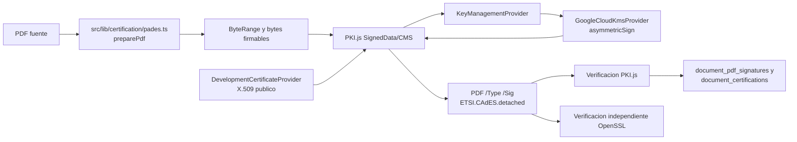

# WP-PADES-KMS-X509-BB - Resultado

## Estado

**PASS - PADES-B-B KMS E2E VERIFIED**

La prueba real se ejecuto contra Google Cloud KMS con Application Default Credentials e impersonacion de la cuenta de servicio configurada. No se genero, exporto ni almaceno ninguna llave privada.

## Arquitectura reutilizada

El trabajo conserva una sola ruta criptografica:



Se reutilizaron:

- `src/lib/certification/key-management.ts`: contrato `KeyManagementProvider` y proveedor Google Cloud KMS.
- `src/lib/certification/pades.ts`: reserva de firma, ByteRange, CMS, insercion `/Contents` y verificador.
- `src/lib/certification/certificates.ts`: registro X.509, cadena de confianza y comparacion canonica SPKI.
- `src/lib/certification/engine.ts`: orquestacion, estados, almacenamiento privado y persistencia posterior a verificacion.
- `document_certifications`, `cryptographic_keys` y `document_pdf_signatures`: no se requirio una tabla paralela ni una migracion adicional.

## X.509 de desarrollo

Se agrego `createKmsSelfSignedDevelopmentCertificate`. El procedimiento es:

1. Obtener la llave publica SPKI con `KeyManagementProvider.getPublicKey()`.
2. Construir el `TBSCertificate` X.509 en DER.
3. Calcular SHA-256 del `TBSCertificate`.
4. Solicitar la firma a la misma version de Google Cloud KMS.
5. Ensamblar el certificado X.509 autofirmado.
6. Verificar su autofirma.
7. Comparar los DER SPKI del certificado y de KMS con comparacion binaria canonica.

Subject usado:

```text
CN=DOCUBOX PAdES Development
O=DOCUBOX
OU=Development
C=MX
```

Algoritmo: RSA 3072, PKCS#1 v1.5 y SHA-256. Proteccion: SOFTWARE. El certificado es exclusivamente de desarrollo.

Resultado de la ejecucion final:

```text
KMS public key fingerprint SHA-256:
82f14970049bc92b15c9679984c7abc15b294bc4954c75cb321beffdb04210ff

X.509 public key fingerprint SHA-256:
82f14970049bc92b15c9679984c7abc15b294bc4954c75cb321beffdb04210ff

Certificate/KMS binding: OK
Certificate fingerprint SHA-256:
0e09eeb0b5263c4843ac77bf07c9349816d699b54de5bc0aaf6cc71801069d59
```

El fingerprint del certificado cambia cuando se emite un nuevo certificado de prueba; el fingerprint SPKI de la version 1 de KMS permanece estable.

## CMS y PAdES-B-B

El motor ya no fuerza RSA-PSS. Obtiene `algorithm`, `keySizeBits`, `keyId` y `keyVersion` desde el proveedor validado y configura PKI.js de acuerdo con la llave real.

Resultado:

```text
ByteRange: OK
CMS detached signature: OK
Certificate: OK
Certificate/KMS binding: OK
Document integrity: OK
Signature verification: OK
Independent OpenSSL verification: OK
Post-signature byte mutation detected: true
PAdES-B-B: VERIFIED
```

El PDF contiene `/Type /Sig`, `/SubFilter /ETSI.CAdES.detached`, ByteRange valido y CMS con el certificado X.509. No se solicito ni se incorporo RFC 3161.

PDF SHA-256 posterior a firma:

```text
1d22b088a778e0e0febd54d4762105088557f1e56655b2eb71a4f1f3f840b250
```

## Persistencia

La fila operativa de `document_certifications` puede existir en estado `PENDING` para soportar idempotencia, leasing, checkpoints y recuperacion. Ninguna capacidad PAdES se marca valida en ese punto.

Solo despues de que el verificador principal y el verificador independiente devuelven `valid=true` se realiza lo siguiente:

- Se inserta `document_pdf_signatures` con estado `VALID`.
- Se actualiza `document_certifications` a `COMPLETED`.
- Se guardan perfil, algoritmo, serial, fingerprint, ByteRange, hash CMS, hash PDF final y resultados de ambos verificadores.
- Se relacionan `document_signing_key_id` y `document_signing_key_version`.
- La metadata publica X.509 se registra en `cryptographic_keys`.
- Cualquier fallo de persistencia de la metadata de llave/certificado ahora detiene el proceso.

El certificado, subject, issuer, vigencia y fingerprint se reutilizan desde `cryptographic_keys`; el detalle PAdES se conserva en `document_pdf_signatures` y en los campos `pades_*` de `document_certifications`. No se almacena material privado.

## Archivos

Modificados:

- `src/lib/certification/key-management.ts`
- `src/lib/certification/certificates.ts`
- `src/lib/certification/pades.ts`
- `src/lib/certification/providers.ts`
- `src/lib/certification/engine.ts`
- `scripts/test-google-kms.ts`
- `package.json`
- `package-lock.json`

Creados:

- `scripts/test-google-kms-pades-bb.ts`
- `output/pdf/docubox-google-kms-pades-bb-e2e.pdf`
- `docs/crypto/wp-pades-kms-x509-bb-result.md`

## Pruebas

```text
npm run type-check                                      PASS
npm run test:kms:gcp                                    PASS - KMS E2E VERIFIED
npm run test:kms:pades-bb                               PASS - PADES-B-B KMS E2E VERIFIED
node --test key-management/KMS/X.509/PAdES              PASS - 18/18
OpenSSL cms -verify                                     PASS
Mutacion posterior de un byte                           RECHAZADA
Render visual Poppler                                   PASS
```

El lint relevante no pudo ejecutarse porque el repositorio usa ESLint 9 pero no contiene `eslint.config.js`. No se creo una configuracion nueva fuera del alcance de este WP.

## Pendientes fuera de alcance

- Configurar en cada entorno de ejecucion las variables no secretas de Google KMS y la ruta/PEM del certificado publico de desarrollo.
- Sustituir el certificado autofirmado de desarrollo por la cadena aprobada para produccion antes de habilitar produccion.
- RFC 3161 y PAdES-B-T permanecen fuera de este WP.
- NOM-151, PAdES-B-LT, PAdES-B-LTA y HSM productivo no fueron modificados.
