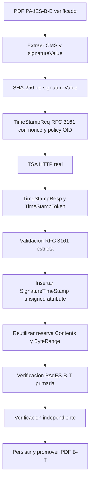

# WP-TSA-RFC3161-PADES-BT - Resultado

## Estado

**PASS - REAL DOCUMENT PADES-B-T VERIFIED**

La implementacion eleva un PDF PAdES-B-B previamente verificado a PAdES-B-T sin volver a firmar el documento ni modificar el flujo B-B existente. El cambio incorpora un `SignatureTimeStamp` RFC 3161 real como atributo CMS no firmado y solo persiste el estado valido despues de la verificacion primaria e independiente.

## Punto de integracion

El flujo productivo se integra en `src/lib/certification/product-integration.ts`:

1. `integratePadesFinalDocument()` ejecuta o reutiliza el PAdES-B-B existente.
2. `PADES_REQUIRED_LEVEL=B-B` conserva el comportamiento B-B.
3. `PADES_REQUIRED_LEVEL=B-T` llama a `upgradePadesBbCertificationToBt()`.
4. La ruta `src/app/api/documentos/[documentId]/seal-signatures/route.ts` reutiliza el B-B verificado y evita volver a renderizar o firmar cuando solo falta la TSA.

No se creo un motor PAdES paralelo. La promocion utiliza `PadesBbPdfSignatureProvider.upgradeToPadesBt()` y el mismo `KeyManagementProvider`, certificado, CMS y verificador independiente ya existentes.

## Flujo criptografico

La llave KMS no vuelve a firmar durante la promocion. El `ByteRange` del PDF B-B se conserva y el token sella el valor de firma CMS existente.

## Validacion RFC 3161

`src/lib/certification/timestamp.ts` valida:

- codigo HTTP y `Content-Type: application/timestamp-reply`;
- estructura DER de `TimeStampResp` y estado RFC 3161;
- `messageImprint` SHA-256;
- nonce, cuando se solicita;
- policy OID configurada;
- firma CMS del token;
- certificado firmante esperado;
- EKU `timeStamping`;
- cadena de confianza en `genTime`;
- vigencia del certificado TSA en `genTime`;
- serial, `genTime`, huella del token y huella del certificado.

Las fallas son explicitas y fail-closed: HTTP, MIME, DER, timeout, imprint, nonce, policy, CMS, certificado y cadena invalida impiden PAdES-B-T.

## Configuracion y seguridad

Variables backend documentadas en `.env.example`:

- `PADES_REQUIRED_LEVEL=B-B|B-T`
- `DOCUBOX_TSA_URL`
- `DOCUBOX_TSA_POLICY_OID`
- `DOCUBOX_TSA_CERTIFICATE_PATH`
- `DOCUBOX_TSA_CHAIN_PATH`
- `DOCUBOX_TSA_TRUST_ROOT_PATH`
- autenticacion Basic, Bearer o token interno opcional
- timeout y algoritmo SHA-256

Los secretos, llaves privadas y tokens no se exponen al frontend. La llave TSA de desarrollo es distinta de la llave KMS firmante y sus archivos generados permanecen fuera de Git.

## Persistencia y Storage

Se reutilizan `document_certifications`, `document_pdf_signatures` y `timestamp_records`; no fue necesaria una tabla paralela.

Se conservan de forma inmutable:

- PDF PAdES-B-B fuente bajo `pades-bb/`;
- PDF PAdES-B-T tecnico bajo `pades-bt/`;
- PDF final promovido bajo `documents-signed/.../pades-bt/`;
- solicitud `.tsq`;
- respuesta `.tsr`;
- token `.tst`;
- reporte JSON de verificacion B-T.

La fila de certificacion se actualiza solo despues de que pasen la verificacion primaria e independiente. La promocion del documento ocurre despues de ese commit logico. Los paths contienen hashes, se escriben con `upsert: false` y un lease evita dos promociones concurrentes de la misma version.

El reintento es idempotente: una certificacion B-T ya verificada se reutiliza, no genera otra firma, token o fila de certificacion, y puede reparar la promocion del puntero final si un fallo ocurrio entre checkpoints.

## Estado de UI y descargas

`src/app/visor-documento/[id]/page.tsx` deriva el estado exclusivamente de evidencia persistida:

- `SIN PADES`
- `PAdES EN PROCESO`
- `PAdES VERIFICADO`
- `PAdES ERROR`

PAdES-B-T exige `timestamp_status=valid` y ambas verificaciones validas. El token RFC 3161 y el reporte tecnico se descargan mediante rutas backend autenticadas; no se publican URLs privadas de Storage.

## Prueba real

- Documento: `1b992070-01de-48ba-a553-c731d2f2b2cd`
- Version: `458f5700-090a-4339-b0c5-fc2d5defe220`
- Certificacion: `c80f012e-c396-4a8b-9300-3b6be6baa865`
- Proveedor TSA: `local-rfc3161-development`
- Policy OID: `1.3.6.1.4.1.55555.1.1`
- `genTime`: `2026-08-29T00:23:01.000Z`
- PDF final: `output/pdf/docubox-real-1b992070-01de-48ba-a553-c731d2f2b2cd-pades-bt.pdf`
- SHA-256 final: `6435A046C529EF8C57539E44B6FB5716B1E26CBCBAEEEA8C0A7B0215263E5C4E`

Resultados:

- B-B fuente preservado: PASS
- `SignatureTimeStamp` presente: PASS
- ByteRange preservado: PASS
- verificacion interna: PASS
- verificacion independiente: PASS
- OpenSSL CMS: PASS
- OpenSSL RFC 3161 contra TSQ: PASS
- alteracion de un byte: FAIL esperado
- Storage y `timestamp_records`: PASS
- reintento idempotente: PASS

## Regresion

- `npm run type-check`: PASS
- pruebas PAdES/TSA enfocadas: 11/11 PASS
- suite KMS, certificados, orquestador, PAdES, TSA y UI: 35/35 PASS
- ESLint de archivos nuevos/modificados del paquete: 0 errores; permanecen 3 advertencias de tipos JSON en el adaptador de persistencia.

## Fuera de alcance

No se implemento NOM-151, PAdES-B-LT, PAdES-B-LTA, revocacion de largo plazo ni migracion a HSM. La TSA usada en la prueba es de desarrollo y no debe presentarse como confianza publica o productiva.
