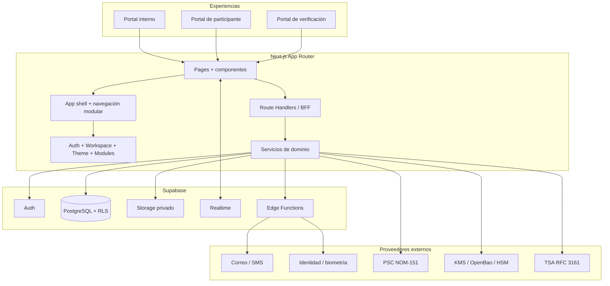

# Arquitectura actual y prompt maestro de plataforma Docubox

## 1. Resumen ejecutivo

Docubox está construido como un **monolito modular multi-tenant** orientado a documentos legales y firma electrónica. La interfaz, los casos de uso y las integraciones viven en una sola aplicación Next.js, mientras que Supabase aporta identidad, PostgreSQL, Row Level Security, Storage privado, Realtime y funciones de backend.

No es una colección de CRUD independientes. El elemento central es el documento y su ciclo de vida:

```text
Original inmutable
  -> versión de trabajo
  -> participantes y campos
  -> firma y evidencias
  -> versión cerrada
  -> certificación / NOM-151 cuando corresponda
  -> verificación pública y auditoría
```

La plataforma distingue tres experiencias:

- **Usuario interno:** administración, preparación, revisión, control, auditoría y cierre.
- **Participante externo:** experiencia guiada, móvil, con acceso por token y únicamente las acciones necesarias.
- **Verificación pública:** consulta limitada mediante folio, QR o identificador no predecible.

## 2. Stack actual

| Capa | Tecnología y responsabilidad |
|---|---|
| Frontend | Next.js 16 App Router, React 19, TypeScript estricto |
| Diseño | Tailwind CSS, variables semánticas, Lucide Icons, Google Sans |
| Estado global | Contextos de autenticación, workspace, tema, sidebar y módulos |
| Backend web | Route Handlers de Next.js como BFF y operaciones privilegiadas |
| Plataforma de datos | Supabase Auth, PostgreSQL, RLS, Storage, Realtime y Edge Functions |
| Documentos | pdf-lib, Tiptap, firma visual, QR y generación de constancias |
| Firma y seguridad | e.firma, autógrafa, Click & Sign, WebAuthn, TOTP y OTP |
| Criptografía | Proveedores desacoplados para llaves, X.509, PAdES, RFC 3161 y verificación |
| Notificaciones | Resend, correo, SMS, notificaciones internas y recordatorios |
| Despliegue | Vercel para la aplicación y Supabase para datos y funciones |

## 3. Diagrama de arquitectura



## 4. Organización del código

```text
src/
  app/
    api/                         # BFF y operaciones server-side
    inicio/                      # Dashboard
    mis-documentos/              # Repositorio documental
    crear-documento/             # Wizard de creación
    visor-documento/[id]/        # Visor, participantes, eventos y descargas
    firmar-documento/[id]/       # Experiencia de firma
    portal-participante/[token]/ # Experiencia externa
    verificar-documento/         # Verificación pública
    formularios/                 # Formularios firmables
    plantillas/                   # Plantillas documentales
    expedientes/                 # Expedientes digitales
    organizacion/                 # Gobierno organizacional
    colabora/                     # Colaboración
    certificaciones/              # Docubox Certifica
  components/
    AppLayout.tsx
    TopNav.tsx
    Sidebar.tsx
    ...                          # Componentes por dominio
  contexts/
    AuthContext.tsx
    WorkspaceContext.tsx
    AppModulesContext.tsx
    ThemeContext.tsx
  lib/
    documents/
    certification/
    forms/
    case-files/
    organization/
    collaboration/
    identity/
    security/
    public-verification/
supabase/
  migrations/                    # Esquema, funciones, índices y RLS
  functions/                     # Flujos backend y proveedores
docs/
  crypto/                        # Inventario, riesgos y WP criptográficos
```

La regla de dependencia recomendada es:

```text
UI -> casos de uso -> servicios de dominio -> adaptadores -> Supabase/proveedores
```

Los componentes no deben conocer llaves, secretos, service roles ni detalles de los proveedores externos.

## 5. Núcleos funcionales

### Plataforma base

- Registro e inicio de sesión con contraseña, OTP, TOTP y WebAuthn.
- Cuenta personal o empresarial.
- Workspaces personales y de organización.
- Selector de workspace activo.
- RBAC por workspace: owner, admin y member, ampliable por permisos.
- App Market para activar módulos y construir navegación dinámica.
- Perfil, configuración, facturación, contactos, tareas y reportes.

### Gestión documental

- Subida desde computadora, móvil o repositorio Docubox.
- Original permanentemente inmutable.
- Versiones de trabajo y versiones cerradas.
- Derivaciones con `derived_from` y conservación del hash inicial.
- Participantes, orden paralelo/secuencial/mixto y roles.
- Campos posicionados sobre PDF.
- Documento público o privado en el portal de verificación.
- Visor con detalles, participantes, comunicación, actividad, vencimientos, notas y descargas.

### Firma y evidencia

- Firma autógrafa digitalizada.
- e.firma SAT, sin almacenar `.key` ni contraseña.
- Click & Sign con consentimiento expreso.
- OTP, identidad, IP, user agent, fecha, zona horaria y versión aceptada.
- Estampas visibles configurables, separadas de la validez criptográfica.
- Constancia individual, constancia general, auditoría de cierre y XML de evidencia.

### Formularios firmables

- Constructor por secciones y campos.
- Validaciones, condiciones, archivos, consentimiento y firma.
- Un único `form_schema` como fuente del formulario web.
- `pdf_schema` como proyección del mismo contenido, no como editor paralelo.
- Respuestas, PDF espejo, firma, evidencia y auditoría.

### Expedientes digitales

- Plantillas, requisitos, invitados, documentos, formularios e identidad.
- Checklist, revisión, observaciones accionables, hitos y firmas.
- Cierre hermético, manifest, hash raíz, QR y constancia de cierre.
- Experiencia interna avanzada y experiencia externa móvil guiada.

### Organización y colaboración

- Datos de organización, directorio, unidades, cargos, roles y permisos.
- Invitaciones, políticas, flujos y auditoría administrativa.
- Espacios de colaboración, salas, recursos, solicitudes, revisiones y comentarios.
- Colabora y Colabora Pro como capacidades contratables separadas.

### Certificación y verificación

- Cadena original y cadena de evidencia canónicas y versionadas.
- Hashes SHA-256 completos.
- `CertificationOrchestrator` idempotente, reintentable y observable.
- Interfaces `KeyManagementProvider`, `CertificateProvider`, `PdfSignatureProvider` y `TimestampAuthorityProvider`.
- PAdES B-B y elevación a B-T únicamente con RFC 3161 verificado.
- NOM-151 como capacidad separada mediante un PSC real.
- Portal de verificación con folio, QR, integridad y acceso documental condicionado por privacidad.

## 6. Modelo de datos por contexto

No se recomienda una tabla universal. Cada contexto conserva sus invariantes y referencias al tenant.

| Contexto | Entidades principales |
|---|---|
| Identidad | user_profiles, sessions, TOTP, WebAuthn, security_events |
| Tenancy | workspaces, workspace_members, roles, permissions |
| Documentos | documentos, document_versions, relations, artifacts, signers, signatures |
| Evidencia | activity_log, audit_trail, signature_evidence, evidence_manifests |
| Certificación | document_certifications, checkpoints, timestamps, keys, provider health |
| Formularios | forms, sections, fields, conditions, responses, answers, PDF templates |
| Expedientes | case_files, requirements, documents, milestones, reviews, manifests |
| Organización | organization_members, units, positions, policies, workflows |
| Colaboración | spaces, rooms, resources, comments, reviews, automations |
| Notificaciones | notifications, recipients, channels, events, certificates |

Todas las tablas de negocio deben incluir directa o indirectamente `tenant_id` o `workspace_id`, índices para sus consultas reales y políticas RLS que impidan accesos cruzados.

## 7. Principios de seguridad

1. Aplicar autenticación en servidor y RLS; ninguna de las dos sustituye a la otra.
2. Mantener `service_role`, credenciales PSC, KMS, TSA y correo exclusivamente en backend.
3. Usar Storage privado y URLs firmadas breves detrás de un visor propio.
4. No sobrescribir originales, versiones firmadas, constancias ni artefactos cerrados.
5. Autorizar por usuario, tenant, rol, documento y participante, según la acción.
6. Congelar la versión documental antes de firmar o certificar.
7. Utilizar `idempotency_key`, locks o leases y checkpoints en procesos críticos.
8. Encadenar la auditoría y conservar payload canónico, secuencia y hashes.
9. No presentar PAdES, X.509, RFC 3161 o NOM-151 como válidos sin verificación técnica.
10. Tratar la firma visual y la firma criptográfica como capas distintas.
11. No persistir la llave ni contraseña de e.firma; procesarlas temporalmente en memoria.
12. Fallar de forma cerrada cuando falte un proveedor productivo o una verificación.

## 8. Lenguaje visual

- Producto SaaS sobrio, operativo y empresarial.
- Fondo claro neutro, superficies blancas y bordes discretos.
- Acento principal `#1E6BFF`; estados verde, ámbar y rojo con significado funcional.
- Google Sans, jerarquía tipográfica contenida y `letter-spacing: 0`.
- Radio máximo habitual de 8 px.
- Lucide para acciones conocidas y tooltips para iconos ambiguos.
- Pocas decisiones por pantalla, progreso visible y mensajes humanos.
- Tablas para comparación y operación repetida; cards solo para unidades reales.
- Mobile-first para participantes e invitados.
- Vista interna más densa, con filtros, auditoría y acciones rápidas.
- Tema oscuro con superficies neutrales y logotipo específico.
- Cierre y constancias con presencia legal formal, datos completos y verificables.

## 9. Prompt maestro reutilizable

El siguiente bloque puede entregarse a otro agente para construir una plataforma con la misma arquitectura. Sustituye los valores entre corchetes antes de usarlo.

```text
Actúa como Principal Software Architect, Staff Full-Stack Engineer, Security
Engineer y Product Designer. Diseña e implementa [NOMBRE_APP], una plataforma
SaaS multi-tenant para gestión documental, firma electrónica, evidencias y
verificación pública, inspirada en la arquitectura funcional de Docubox.

OBJETIVO

Construye un monolito modular mantenible. El documento y su ciclo de vida deben
ser el núcleo del sistema. No construyas veinte CRUD aislados ni prototipos que
simulen procesos críticos. Implementa verticales funcionales completas, con UI,
casos de uso, persistencia, autorización, auditoría y pruebas.

STACK BASE

- Next.js App Router, React y TypeScript estricto.
- Tailwind CSS con tokens semánticos y Lucide Icons.
- Supabase Auth, PostgreSQL, RLS, Storage privado, Realtime y Edge Functions.
- Route Handlers de Next.js como BFF para operaciones privilegiadas.
- Vercel para la aplicación web y tareas programadas.
- Adaptadores backend para correo, SMS, identidad, PSC, KMS y TSA.

ARQUITECTURA

Organiza el código por dominios:

- identity y security
- tenancy y workspaces
- documents y versions
- signing y evidence
- forms
- case-files
- organization
- collaboration
- notifications
- certification
- public-verification

Respeta esta dirección de dependencias:

UI -> casos de uso -> servicios de dominio -> interfaces -> adaptadores externos.

La UI nunca debe conocer secretos, service roles, llaves privadas o detalles de
KMS, TSA, PSC y proveedores de correo.

EXPERIENCIAS

1. Portal interno: potente, con revisión, control, filtros, roles, auditoría,
   hitos, reportes y cierre.
2. Portal de participante: simple, guiado, móvil, con checklist, correcciones
   accionables y acceso por token seguro.
3. Portal público: consulta por folio o QR, sin exponer datos privados ni rutas
   directas de Storage.

PLATAFORMA BASE

- Registro de cuenta personal o empresarial.
- Workspace personal automático y workspace empresarial administrable.
- Miembros, owner/admin/member, roles granulares y aislamiento por tenant.
- App Market que active módulos y modifique navegación y permisos.
- Login con contraseña, OTP, TOTP y WebAuthn, más step-up para acciones sensibles.
- Perfil, organización, contactos, tareas, notificaciones, reportes y facturación.

GESTIÓN DOCUMENTAL

- Permite subir PDF/DOCX desde computadora, móvil o repositorio interno.
- Conserva siempre el archivo original como objeto inmutable.
- Distingue original, versión de trabajo y versión cerrada.
- Toda reutilización editable crea una derivación con referencia `derived_from`.
- Conserva hash SHA-256, tamaño, MIME, fecha, autor y relación entre versiones.
- Configura participantes, roles, orden paralelo/secuencial/mixto y vencimientos.
- Permite posicionar campos sobre el PDF sin alterar versiones cerradas.
- Incluye visor propio; nunca muestres al usuario la URL firmada de Storage.

FIRMA Y EVIDENCIA

- Soporta firma autógrafa digitalizada, e.firma y Click & Sign.
- Registra consentimiento, identidad, correo, IP, user agent, fecha UTC, zona
  horaria, versión del documento, hash y eventos del proceso.
- No guardes archivos `.key` ni contraseñas de e.firma.
- Separa estrictamente la estampa visual de la firma criptográfica.
- Genera constancia individual, constancia general, auditoría al cierre, XML y
  paquete de evidencia con información real, completa y no abreviada.

FORMULARIOS FIRMABLES

- Constructor con secciones, preguntas, validaciones, condiciones, archivos y
  bloques de firma.
- Un `form_schema` debe renderizar el formulario web.
- Un `pdf_schema` debe definir la representación PDF del mismo contenido.
- No construyas dos editores independientes.
- El envío debe generar PDF espejo, evidencia, firma y auditoría.

EXPEDIENTES

- Plantillas, participantes, documentos requeridos, formularios, identidad,
  revisiones, observaciones, hitos, firmas y cierre.
- El invitado ve checklist y correcciones concretas.
- El responsable interno controla aprobación, cierre y excepciones.
- Al cerrar, congela el expediente, crea manifest, hash raíz, QR y constancia.

ORGANIZACIÓN Y COLABORACIÓN

- Directorio, unidades, cargos, roles, permisos, invitaciones y políticas.
- Espacios y salas de colaboración, recursos, comentarios, revisiones,
  solicitudes, comités y automatizaciones.
- Mantén la administración organizacional separada de la colaboración cotidiana.

CERTIFICACIÓN

- Implementa `CertificationOrchestrator` idempotente, reintentable,
  transaccional, observable, multi-tenant y fail-closed.
- Usa interfaces `KeyManagementProvider`, `CertificateProvider`,
  `PdfSignatureProvider` y `TimestampAuthorityProvider`.
- Congela la versión exacta, calcula hash previo, genera cadenas canónicas,
  recupera evidencias, firma, verifica y almacena artefactos inmutables.
- PAdES B-B solo es válido con ByteRange, CMS y certificado X.509 verificados.
- PAdES B-T solo es válido con TimeStampToken RFC 3161 verificado.
- NOM-151 es independiente y solo puede marcarse válida con respuesta comprobada
  de un Prestador de Servicios de Certificación.
- Nunca conviertas `created_at`, texto, una imagen o metadata en evidencia
  criptográfica.

DATOS Y SEGURIDAD

- Toda entidad de negocio debe pertenecer a un tenant/workspace.
- Diseña RLS para lectura y mutación, con pruebas de acceso entre tenants.
- Aplica RBAC en servidor y políticas de mínimo privilegio.
- Usa Storage privado con paths por tenant y URLs firmadas de corta duración.
- No permitas `upsert` sobre originales o artefactos cerrados.
- Usa locks/leases, `idempotency_key` y checkpoints para operaciones críticas.
- Encadena auditoría con `sequence_number`, `previous_event_hash`, `event_hash`,
  payload canónico y versión de esquema.
- No expongas secretos con prefijos públicos ni mensajes de error sensibles.

DISEÑO VISUAL

- Estilo SaaS moderno, sobrio, denso y empresarial.
- Fondo neutro claro, cards blancas, bordes suaves y acento [COLOR_PRIMARIO].
- Usa Google Sans, Lucide Icons, radio máximo habitual de 8 px y espaciado
  consistente.
- Evita hero marketing, gradientes decorativos, cards anidadas y pantallas con
  demasiadas decisiones.
- Usa tablas para operación repetida, estados tipo semáforo, wizards con progreso
  y mensajes humanos con una acción de corrección.
- La experiencia externa debe ser mobile-first; la interna puede ser avanzada.
- Implementa tema oscuro neutral y logos adecuados para cada tema.

METODOLOGÍA DE IMPLEMENTACIÓN

1. Audita el repositorio antes de editar y crea una matriz conservar/extender/
   refactorizar/crear.
2. Define bounded contexts, contratos y estados antes de crear pantallas.
3. Integra Supabase desde el inicio, no al final.
4. Aplica migraciones pequeñas, no destructivas y reversibles.
5. Implementa verticales en este orden:
   a. auth + tenancy + shell;
   b. documento + original + versiones;
   c. participantes + invitaciones + portal externo;
   d. firma + evidencia + visor;
   e. formularios y expedientes;
   f. organización, colaboración y marketplace;
   g. certificación y verificación pública.
6. No declares operativo un proveedor externo hasta superar su health check y
   verificación independiente.
7. Añade pruebas unitarias, integración, RLS multi-tenant y E2E en cada vertical.
8. Verifica visualmente escritorio y móvil antes de dar por terminada una vista.

CRITERIOS DE ACEPTACIÓN

- Una cuenta no puede leer ni modificar recursos de otro tenant.
- El original nunca se sobrescribe y cada versión tiene trazabilidad completa.
- Las invitaciones llevan al participante y documento correctos.
- Paralelo y secuencial activan participantes correctamente.
- Las firmas y constancias contienen únicamente datos reales.
- Un cambio de un byte invalida la verificación correspondiente.
- Las descargas respetan privacidad, rol y estado documental.
- Reintentar una operación crítica no duplica firmas, correos ni artefactos.
- La UI no muestra como válida una capacidad no configurada o no verificada.
- Los flujos principales funcionan en escritorio y móvil.

ENTREGABLES

- Arquitectura y diagramas Mermaid.
- Modelo de datos y migraciones Supabase.
- Matriz RLS/RBAC por recurso y acción.
- Aplicación funcional por verticales.
- Contratos de proveedores e integraciones.
- Pruebas unitarias, integración, seguridad y E2E.
- Runbooks de despliegue, secretos, rollback, respaldo y recuperación.
- Registro explícito de funciones incompletas, simuladas o dependientes de un
  proveedor externo.
```

## 10. Decisión arquitectónica principal

Para una aplicación con los mismos elementos conviene conservar el **monolito modular** mientras un solo equipo desarrolle la plataforma. Next.js funciona como frontend y BFF; Supabase cubre servicios de plataforma; los dominios permanecen separados en código y datos; y los proveedores criptográficos o regulatorios se aíslan mediante interfaces.

Solo conviene extraer servicios independientes cuando exista una necesidad medible: aislamiento criptográfico, carga asíncrona intensa, límites operativos, requisitos regulatorios o equipos con despliegues autónomos. La primera extracción natural sería el motor de certificación, no la gestión documental completa.
