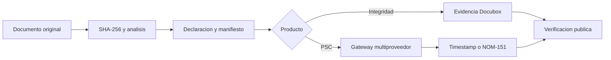

# Docubox Certifica

## Alcance implementado

La fase base conecta App Market, navegacion, dashboard, wizard, detalle y portal publico con Supabase. Conserva el original en un bucket privado e inmutable, calcula SHA-256 antes de almacenarlo, vuelve a comprobarlo antes de emitir, crea un manifiesto canonico y registra una bitacora encadenada.



## Limites juridicos

- `integrity` registra integridad y evidencia interna Docubox; no se presenta como una NOM-151.
- `sandbox` siempre muestra `NO VALIDO / DEMOSTRACION`.
- `production` falla de forma cerrada si no existen endpoint, token de backend o una respuesta PSC valida.
- Las llaves y tokens no se almacenan en tablas ni se envian al navegador.

## Configuracion del proveedor

Variables exclusivas del backend:

```text
CERTIFICA_PSC_MODE=sandbox|production
CERTIFICA_PSC_BASE_URL=https://proveedor.example
CERTIFICA_PSC_API_TOKEN=<secret-manager>
CERTIFICA_PSC_WEBHOOK_SECRET=<secret-manager>
METADEFENDER_API_KEY=<secret-manager>
```

En produccion, `METADEFENDER_API_KEY` o un analizador equivalente es obligatorio para aceptar cargas.

## Datos y seguridad

- Migraciones: `20260817044200_docubox_certifica_phase1.sql` y `20260817051500_docubox_certifica_hardening.sql`.
- Todas las tablas del modulo tienen RLS.
- Los buckets son privados y sus rutas comienzan con `workspace_id`.
- `certification_files`, `certification_evidences`, `certification_manifests` y `certification_case_events` rechazan actualizaciones y borrados.
- El portal publico resuelve un token aleatorio almacenado unicamente como SHA-256.

## Fases posteriores

El adaptador HTTP productivo ya tiene contrato fail-closed. Para activar efectos PSC reales se necesita contratar/configurar un PSC acreditado, mapear su API y validar sus artefactos nativos. Lotes, facturacion conciliada, webhooks administrables, renovaciones y validacion PAdES avanzada deben completarse como paquetes independientes sin debilitar el flujo base.

